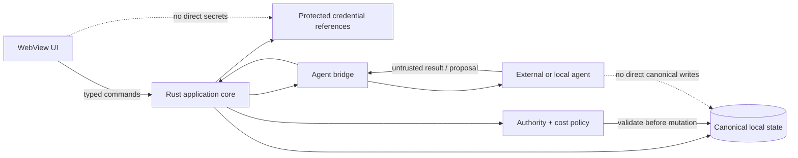

# Security Policy

## Security posture

B.O.B. is a local-first desktop application that coordinates local state with optional external or local AI agents. Its primary security goal is to keep authority explicit: the UI, application core, canonical data, credentials, agent processes, and delegated workspaces must not collapse into one ambient trust domain.

## Trust model

## Required controls

- Renderer/UI code must not receive unrestricted native, filesystem, shell, or credential authority.
- Secrets must use platform-appropriate protected storage where available and must never be written to ordinary logs, prompts, fixtures, screenshots, or canonical task data.
- Agent bridges receive only the context needed for the request.
- Agent output is untrusted input until B.O.B. validates proposed application actions.
- Normal Assist mode must not implicitly grant filesystem or shell execution.
- Delegate mode must identify the bounded workspace, granted capabilities, provider, and cost class before execution.
- Provider changes must not silently widen authority.
- Metered inference is disabled unless explicitly enabled by the user.
- Unknown provider billing classification fails closed.
- Canonical user state must remain exportable and recoverable without a model vendor.
- External-process failures, cancellation, malformed output, and version drift must fail safely rather than corrupt canonical state.

## Dependency and supply-chain posture

The revived application starts from a clean dependency graph rather than inheriting the retired Electron/Ollama stack. New dependencies must be justified by active architecture, kept current, and reviewed for install-time behavior, native authority, network access, and transitive risk.

Generated model artifacts and downloaded model weights do not belong in Git history unless a specific reviewed distribution decision requires them.

## Vulnerability reporting

B.O.B. is currently private. Report suspected vulnerabilities privately to the repository owner through an appropriate private channel. Do not open public vulnerability details if the repository becomes public before a disclosure process and contact route are documented.

## Supported versions

The revived implementation has not yet reached a supported release. Supported-version and disclosure-response commitments will be defined before the first public release candidate.
