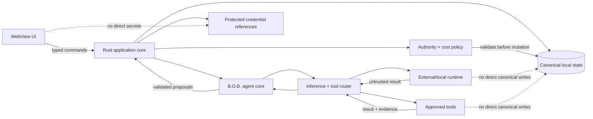

# Security Policy

## Security posture

B.O.B. is a local-first desktop application with one user-facing agent identity and optional external or local inference runtimes and tools behind it. Its primary security goal is to keep authority explicit: the UI, B.O.B. agent core, canonical data, credentials, inference processes, tools, and delegated workspaces must not collapse into one ambient trust domain.

## Trust model

The user delegates to B.O.B., not to a visible collection of peer agents. Models and runtimes are inference capabilities. Tools and execution surfaces receive only the authority B.O.B. is explicitly allowed to exercise for the task.

## Required controls

- Frontend/UI code must not receive unrestricted native, filesystem, shell, or credential authority.
- Secrets must use platform-appropriate protected storage where available and must never be written to ordinary logs, prompts, fixtures, screenshots, or canonical task data.
- Runtime adapters receive only the context needed for the request.
- Model/runtime and tool output is untrusted input until B.O.B. validates proposed application actions.
- Normal Assist mode must not implicitly grant filesystem, shell, repository, or external-workspace execution.
- Delegate mode must identify the bounded workspace, granted capabilities/tools, runtime or provider where relevant, and cost class before execution.
- Runtime/provider changes must not silently widen authority.
- Metered inference is disabled unless explicitly enabled by the user.
- Unknown provider billing classification fails closed.
- Canonical user state must remain exportable and recoverable without a model vendor.
- External-process failures, cancellation, malformed output, and version drift must fail safely rather than corrupt canonical state.
- Multiple inference runtimes must not create multiple canonical B.O.B. identities or independent systems of record.

## Dependency and supply-chain posture

The revived application starts from a clean dependency graph rather than inheriting the retired Electron/Ollama stack. New dependencies must be justified by active architecture, kept current, and reviewed for install-time behavior, native authority, network access, and transitive risk.

Generated model artifacts and downloaded model weights do not belong in the active source tree unless a specific reviewed distribution decision requires them.

B.O.B. intentionally keeps repository CI small. The implementing developer or coding agent is responsible for relevant dependency, build, test, lint, type, and targeted security validation before requesting review.

## Reporting a vulnerability

**Do not open a public issue for a suspected vulnerability. Do not include credentials, exploit details, private data, or sensitive logs in normal issues or pull requests.**

If the repository's **Security** tab offers **Report a vulnerability**, use GitHub Private Vulnerability Reporting. Reports submitted there remain private to the reporter and repository maintainers while the issue is investigated.

If that private reporting control is unavailable, contact the repository owner privately using the contact information available through the owner's GitHub profile. Do not fall back to a public issue.

A useful report includes the affected version or commit, impact, reproduction steps, relevant configuration, and a minimal proof of concept when appropriate. Please redact secrets and unrelated personal information.

Maintainers will acknowledge and investigate reports in good faith, but no formal response-time SLA applies until a supported release defines one.

## Disclosure

Please allow maintainers a reasonable opportunity to investigate and remediate a vulnerability before public disclosure. Coordinated disclosure details, affected versions, and credits can be agreed through the private advisory when applicable.

## Supported versions

The revived implementation has not yet reached a supported release. Supported-version and security-response commitments will be defined before the first release candidate.

## Repository history

The repository contains historical pre-revival implementation material in older Git history and a named archive branch. Historical material is not supported software and must not be treated as the current security architecture. If a credential or sensitive artifact is ever identified in repository history, rotate or invalidate it first, then remove it from reachable history where practical.
