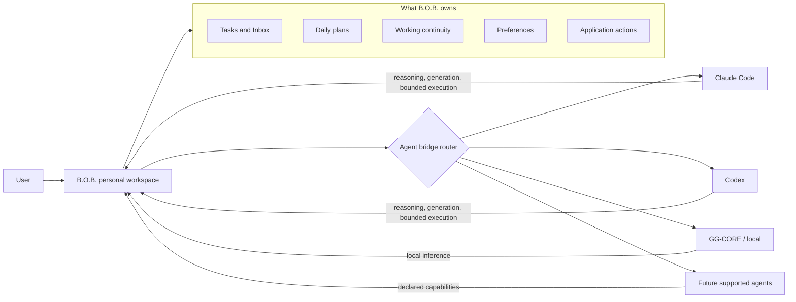
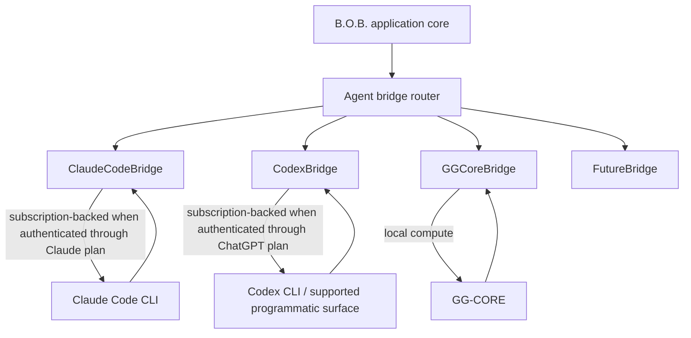
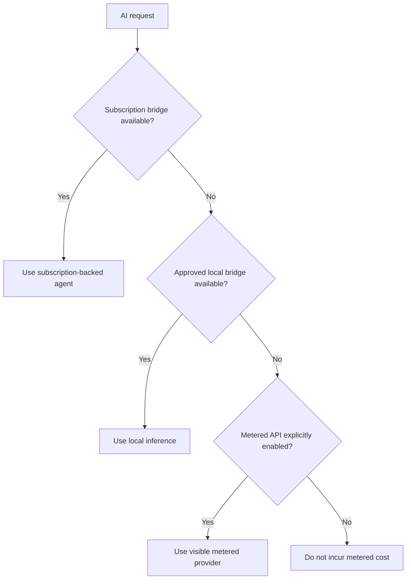
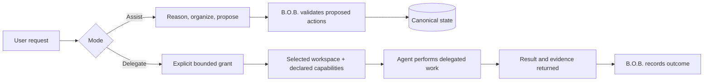
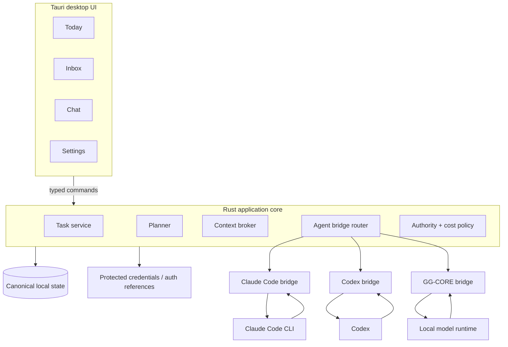
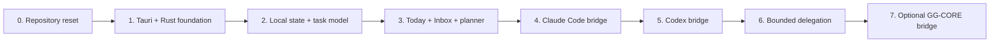

<div align="center">

# B.O.B.

### Better Organized Brain

**One personal workspace for Claude, Codex, local models, and the work between them.**

A vendor-neutral, ADHD-friendly AI workbench that owns your tasks, plans, context, and continuity while specialized agents provide the intelligence.

**B.O.B. owns the work. Agents provide the intelligence.**

</div>

---

> [!IMPORTANT]
> **Revival status:** the product and architecture baseline is established, but the revived application is not yet runnable from `master`. The legacy Electron/Ollama prototype has been retired from the active tree. Implementation now proceeds from the accepted product, architecture, PRD, RFC, and ADR set in [`docs/`](docs/).

## Why B.O.B. exists

Claude, ChatGPT, Claude Code, Codex, and other AI systems already have excellent first-party applications. B.O.B. is not trying to build weaker copies of them.

The problem is that each vendor application owns a separate island of context, sessions, workflows, and interface conventions. A person who uses more than one agent has to remember where work lives, restate context, move tasks between tools, monitor different usage limits, and repeatedly decide what to do next.

B.O.B. is the layer above those islands.

It provides one durable personal workspace where:

- tasks and plans belong to the user, not to a model session;
- Claude Code, Codex, GG-CORE, and future supported agents can be used through bounded bridges;
- the same work can move between agents without losing its organizing context;
- subscription-backed inference is preferred before metered APIs;
- local inference can be used when privacy, availability, or cost makes it preferable;
- AI can help without becoming a prerequisite for basic planning and task management;
- the interface is intentionally designed to reduce executive-function load rather than expose every feature at once.

That distinction is the product.

## The product in one picture



The durable unit is the **work**, not the vendor conversation.

## What using B.O.B. should feel like

B.O.B. starts from the user's day, not from an empty prompt box.

```text
┌──────────────────────────────────────────────────────────────────────┐
│ B.O.B.                                                     Wednesday │
├──────────────────────────────────────────────────────────────────────┤
│ TODAY                                                                │
│                                                                      │
│ What matters                                                        │
│   1. Finish release notes                         45 min             │
│   2. Review pull request                          30 min             │
│   3. Call dentist                                 10 min             │
│                                                                      │
│ NEXT                                                                 │
│   Finish release notes                                              │
│   You have 52 minutes before the next fixed commitment.             │
│                                                                      │
│   [ Start ]   [ Break it down ]   [ Not now ]                       │
│                                                                      │
│ Quick capture: What's in your head? _____________________________    │
│                                                                      │
│ [ Plan my day ] [ Replan ] [ I'm overwhelmed ] [ Ask B.O.B. ]      │
└──────────────────────────────────────────────────────────────────────┘
```

The goal is not to display the maximum amount of information. The goal is to make the **next useful action obvious** while keeping everything else recoverable.

## Four primary surfaces

| Surface | Job | Deliberate constraint |
| --- | --- | --- |
| **Today** | Focus, schedule, next action, quick capture, replanning | Does not become a giant backlog dashboard |
| **Inbox** | Hold unprocessed tasks, ideas, notes, reminders, and brain dumps | Capture first, categorize later |
| **B.O.B. Chat** | Organize, plan, break down, reason, and delegate through the selected agent | Chat is an interface to the work, not the system of record |
| **Settings** | Configure agents, cost policy, accessibility, privacy, and local data behavior | Advanced configuration stays out of the daily workflow |

There is intentionally no separate Idea Board, Knowledge Center, Insights dashboard, cognitive-profile screen, or plugin marketplace in the initial revival scope.

## ADHD-friendly by interaction design

B.O.B. does not attempt to diagnose ADHD, infer cognitive traits, score neurodivergence, or model the user's brain.

Instead, the product applies practical interaction constraints:

- **Capture before organization.** Getting something out of working memory should be cheaper than deciding exactly where it belongs.
- **One obvious next action.** The interface should answer “what should I do now?” before exposing secondary choices.
- **Small daily focus.** A day plan should emphasize a few meaningful priorities rather than elevate the entire backlog into an emergency.
- **Cheap replanning.** A disrupted day is normal. Replanning should not feel like failing a plan.
- **Progressive disclosure.** Detail appears when requested instead of competing for attention by default.
- **Interruption recovery.** B.O.B. should preserve where the user was and make resumption obvious.
- **Overwhelm reduction.** A reduced-information mode can temporarily hide nonessential choices and surface one manageable action.
- **Accessible presentation.** Font, contrast, motion, density, keyboard use, and readable hierarchy are product requirements.
- **No guilt mechanics.** Productivity statistics must never become a behavioral scorecard masquerading as encouragement.

See [`docs/DESIGN.md`](docs/DESIGN.md) and [`docs/prd/PRD-0002-adhd-friendly-daily-planning.md`](docs/prd/PRD-0002-adhd-friendly-daily-planning.md).

## Agent bridges, not vendor lock-in

B.O.B. integrates agent surfaces through a small capability boundary rather than making any one vendor part of the application core.



A bridge reports what it can actually do. B.O.B. does not pretend every model or agent has identical capabilities.

Initial integration priorities are:

| Priority | Bridge | Primary value | Cost class |
| --- | --- | --- | --- |
| 1 | **Claude Code** | General reasoning, writing, planning, coding, bounded agent work | Subscription-backed |
| 2 | **Codex** | Coding, repository work, shell-oriented agent tasks | Subscription-backed |
| 3 | **GG-CORE** | Private/offline local inference | Local compute |
| Later | Other supported agents | Capability-specific value | Must declare cost class |

Direct metered APIs are not the default integration path.

## Cost is an architectural boundary

B.O.B. is specifically designed to avoid turning routine personal organization into an unpredictable inference bill.



The rule is simple:

> **Subscription first. Local second. Metered only by explicit consent.**

B.O.B. must never silently fail over from an included subscription allowance to per-token API billing. Unknown billing behavior fails closed.

See [`docs/governance/AI_COST_AND_PROVIDER_POLICY.md`](docs/governance/AI_COST_AND_PROVIDER_POLICY.md).

## Assist and Delegate are different authority levels

A planning conversation and a coding agent should not receive the same permissions merely because both happen to involve an LLM.



**Assist** is the default. Agents can reason and propose, but B.O.B. owns application mutations.

**Delegate** is explicit. The user grants a specific agent a bounded task, workspace, capability set, and known cost class.

See [`docs/adr/ADR-0005-assist-vs-delegate-authority.md`](docs/adr/ADR-0005-assist-vs-delegate-authority.md).

## Target architecture

The revival targets a small desktop application with a strong native boundary and a web-quality interface.



### Architectural commitments

| Concern | Decision |
| --- | --- |
| Desktop shell | Tauri 2 target |
| Native application boundary | Rust |
| Frontend | Lightweight TypeScript web UI; framework only if justified |
| Canonical state | Local-first and B.O.B.-owned |
| Agent integration | Capability-declared bridges |
| Normal agent authority | Propose, do not silently mutate |
| Delegated authority | Explicit, bounded, inspectable |
| AI availability | Optional for core task/planning behavior |
| Inference cost | Subscription-first; metered opt-in only |
| Local inference | Optional GG-CORE bridge, not an app prerequisite |
| Local HTTP AI server | Not part of the target architecture |
| Vector database / RAG | Not part of initial revival scope |

The detailed trust boundaries, data flows, and component responsibilities live in [`docs/ARCHITECTURE.md`](docs/ARCHITECTURE.md).

## Current state

The repository is intentionally between generations.

**Established:**

- product definition and scope;
- target architecture and trust boundaries;
- daily-planning and ADHD-friendly interaction model;
- agent bridge model;
- subscription-first cost policy;
- Assist versus Delegate authority model;
- PRDs, RFCs, ADRs, governance, security, and implementation sequencing.

**Not yet implemented on the revival line:**

- Tauri application shell;
- canonical local persistence;
- Today and Inbox production surfaces;
- deterministic planner;
- Claude Code bridge;
- Codex bridge;
- GG-CORE bridge;
- packaging and release automation.

This README will not claim those capabilities until they exist and are verified. Documentation is a product interface, not a wishlist with better typography.

## Implementation sequence



AI does not come first. B.O.B. should become a competent task and daily-planning application before an agent is allowed to make it clever.

See [`docs/IMPLEMENTATION_PLAN.md`](docs/IMPLEMENTATION_PLAN.md) and [`docs/ROADMAP.md`](docs/ROADMAP.md).

## Repository layout

The active root is deliberately small:

```text
B.O.B./
├── .github/        GitHub workflows, templates, contribution and security policy
├── docs/           Product, architecture, design, governance and decision records
├── .gitignore      Repository ignore rules
├── AGENTS.md       Binding instructions for coding agents
└── README.md       Product and repository front door
```

Historical implementation code is not kept in the active tree merely because it once existed. Git already has a memory. It does not require every abandoned experiment to remain in the foyer.

## Documentation map

| Need | Start here |
| --- | --- |
| Understand the product | [`docs/PRODUCT.md`](docs/PRODUCT.md) |
| Understand the system | [`docs/ARCHITECTURE.md`](docs/ARCHITECTURE.md) |
| Understand the user experience | [`docs/DESIGN.md`](docs/DESIGN.md) |
| See implementation order | [`docs/IMPLEMENTATION_PLAN.md`](docs/IMPLEMENTATION_PLAN.md) |
| See release direction | [`docs/ROADMAP.md`](docs/ROADMAP.md) |
| Review product requirements | [`docs/prd/`](docs/prd/) |
| Review implementation proposals | [`docs/rfc/`](docs/rfc/) |
| Review durable decisions | [`docs/adr/`](docs/adr/) |
| Review governance | [`docs/governance/`](docs/governance/) |
| Understand legacy history | [`docs/legacy/`](docs/legacy/) |
| See documentation traceability | [`docs/TRACEABILITY.md`](docs/TRACEABILITY.md) |
| Contribute | [`.github/CONTRIBUTING.md`](.github/CONTRIBUTING.md) |
| Review security model | [`.github/SECURITY.md`](.github/SECURITY.md) |

The full documentation index is [`docs/README.md`](docs/README.md).

## Deliberate non-goals

The initial revival does **not** include:

- cognitive profiling or inferred neurodivergence scoring;
- medical or diagnostic guidance;
- a proprietary foundation model;
- an Ollama dependency;
- a bundled vector database or general-purpose RAG knowledge center;
- a background autonomous agent with ambient authority;
- silent metered API fallback;
- cloud sync or multi-user collaboration;
- a plugin marketplace;
- generalized project-management software;
- rebuilding vendor-specific Claude, ChatGPT, or Codex interfaces feature for feature.

New scope must justify why B.O.B. should own it instead of letting an existing agent do the work.

## Legacy preservation

The original Electron/Ollama-era implementation, experimental AI server, RAG work, Python skeletons, historical version folders, model artifacts, and related npm dependency graph are preserved outside the active tree on:

`archive/pre-revival-cleanup-2026-08-19`

The archive is historical evidence, not a supported release line and not an implementation reference unless a current design document explicitly calls something back in.

See [`docs/legacy/README.md`](docs/legacy/README.md).

## Governance and contribution

B.O.B. is intentionally small, but small does not mean undocumented.

Material changes are traceable through three record types:

- **PRD:** what user problem and behavior the product owns;
- **RFC:** how a meaningful implementation or protocol should work;
- **ADR:** which durable architectural decision governs future work.

Implementation must agree with accepted records. If the decision changes, supersede the record. Do not quietly edit history until the code appears innocent.

Project governance is documented in [`docs/governance/GOVERNANCE.md`](docs/governance/GOVERNANCE.md). Coding-agent requirements are binding in [`AGENTS.md`](AGENTS.md).

## Privacy and security posture

B.O.B. is local-first, not local-only.

Canonical personal state remains local by default. Remote agents receive bounded context intentionally. Credentials do not belong in renderer code, logs, prompts, or ordinary local state. Agent output is untrusted until validated. Filesystem and shell authority require an explicit delegated boundary.

The current security contract is documented in [`.github/SECURITY.md`](.github/SECURITY.md).

## Release and license status

B.O.B. is currently a private revival project and has not reached a supported revival release. Public distribution, licensing, support guarantees, and compatibility commitments will be defined before a public release candidate.

---

<div align="center">

### Better Organized Brain

**Keep the work in one place. Use the right intelligence for the job. Make the next step easier to see.**

</div>
