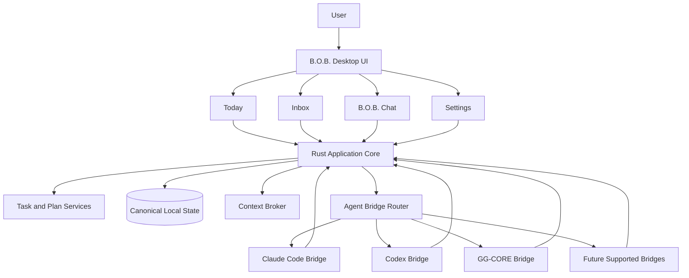

# B.O.B. | Better Organized Brain

B.O.B. is a vendor-neutral personal AI workspace that keeps tasks, plans, context, and attention organized around the user while allowing multiple AI agents to provide intelligence through one consistent surface.

> **B.O.B. owns the work. Agents provide the intelligence.**

## Project status

B.O.B. is being revived from an early alpha implementation. The existing Electron/Ollama-era code is historical implementation material, not the current architectural contract. The authoritative direction is defined by the documentation linked below.

The revival is intentionally small in scope. B.O.B. is not trying to replace ChatGPT, Claude, Codex, Claude Code, or any other vendor application. It is the personal control plane above supported agent interfaces.

## Product promise

B.O.B. helps a user:

- capture tasks, ideas, reminders, and brain dumps quickly;
- decide what matters now without staring at an undifferentiated backlog;
- build and replan a realistic day;
- ask one consistent assistant to organize work;
- use Claude Code, Codex, local inference, and future supported agent surfaces without changing applications;
- preserve useful continuity independently of any one vendor session;
- avoid accidental metered inference costs through an explicit subscription-first cost policy.

B.O.B. is ADHD-friendly by interaction design. It is not a diagnostic system, cognitive profiler, medical device, or behavioral scoring engine.

## Primary surfaces

| Surface | Purpose |
| --- | --- |
| **Today** | Focus items, schedule, next action, replanning, and quick capture |
| **Inbox** | Unprocessed tasks, ideas, notes, reminders, and brain dumps |
| **B.O.B. Chat** | Natural-language organization, planning, breakdown, and delegation |
| **Settings** | Agent bridges, cost policy, accessibility, local data, and preferences |

## Architecture at a glance

The application core owns user state and application actions. Agent bridges receive bounded context, return responses or proposed actions, and do not become the system of record.

## Core product principles

1. **User-owned continuity.** B.O.B. is the canonical home for tasks, plans, preferences, and working context.
2. **Vendor neutrality.** Agent integrations are bridges, not architectural dependencies.
3. **Subscription first.** Subscription-backed agent usage is preferred over metered API usage. Metered usage must be explicitly enabled.
4. **Local first, not local only.** Core data remains local by default while remote agents may be used intentionally.
5. **AI-assisted, not AI-dependent.** Core task capture, planning, scheduling, and organization remain useful without an available model.
6. **Explicit authority.** Agents may propose application actions. B.O.B. owns validation and execution.
7. **Low cognitive load.** The interface prioritizes the next useful action over exposing every available feature at once.
8. **Small surface area.** New infrastructure must justify itself against the product promise.

## Documentation map

Start with [`docs/README.md`](docs/README.md).

Key documents:

- [`docs/PRODUCT.md`](docs/PRODUCT.md): product definition and boundaries
- [`docs/ARCHITECTURE.md`](docs/ARCHITECTURE.md): target system architecture and trust boundaries
- [`docs/DESIGN.md`](docs/DESIGN.md): interaction and visual information architecture
- [`docs/IMPLEMENTATION_PLAN.md`](docs/IMPLEMENTATION_PLAN.md): staged revival plan
- [`docs/ROADMAP.md`](docs/ROADMAP.md): release-oriented roadmap
- [`GOVERNANCE.md`](GOVERNANCE.md): project governance and change authority
- [`SECURITY.md`](SECURITY.md): security and trust model
- [`AGENTS.md`](AGENTS.md): repository rules for coding agents

Product requirements, RFCs, and architecture decisions live under `docs/prd/`, `docs/rfc/`, and `docs/adr/` respectively.

## Historical code

The repository contains experimental Electron, Ollama, RAG, Python, module-system, and adaptive-behavior work from the original prototype. Git history preserves that work. The revival plan intentionally avoids treating historical implementation choices as current requirements.

## License and release status

B.O.B. is currently a private revival project. Distribution, licensing, and public release terms must be explicitly decided before any public release.
