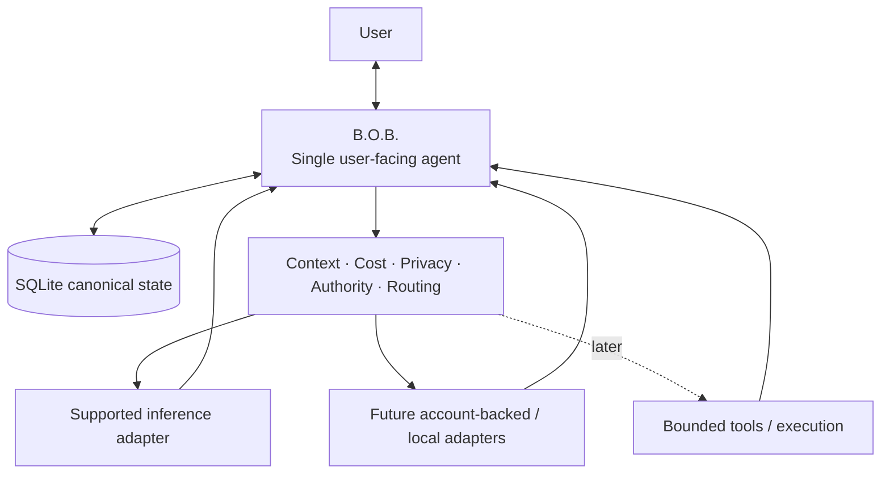
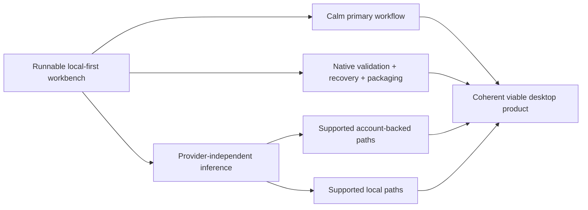

<div align="center">

# B.O.B.

### Better Organized Brain

**One agent. Less friction. The right intelligence when it matters.**

[](LICENSE)


A local-first, ADHD-friendly personal AI workbench that keeps tasks, plans, context, preferences, and continuity under one B.O.B.-owned surface while inference runtimes remain replaceable capabilities behind the scenes.

> **B.O.B. is the agent. Models, runtimes, provider APIs, and tools are capabilities.**

</div>


> [!IMPORTANT]
> **Current status:** B.O.B. is in active pre-alpha development on a Tauri 2 + Rust desktop foundation. The revived implementation is now present on `master`, including Rust-owned local state, Today/Inbox workflows, deterministic planning, B.O.B. Assist/proposal boundaries, recovery/export work, accessibility preferences, and a gated Gemini API capability. Release-readiness and rendered/native validation are still in progress. The retired Electron/Ollama prototype is historical only.

## Why B.O.B. exists

AI products are capable, but they are fragmented. Different providers bring different models, sessions, billing systems, permissions, and interfaces. Ordinary productivity tools preserve tasks but usually lack a coherent reasoning layer. Generic AI chat can reason well but does not own durable personal planning and executive-function structure.

B.O.B. sits between those worlds.

The user talks to **B.O.B.** B.O.B. owns the work, continuity, deterministic services, and policy. Supported inference runtimes can change over time without turning the application into a roster of competing agents or moving canonical state into a provider session.

The user should not need an architecture diagram in their head to get through Tuesday.

## Product principles

> **Only the things that matter should compete for attention.**

B.O.B. is designed around a few durable rules:

- **One user-facing agent.** B.O.B. remains the identity regardless of which inference capability is used.
- **Local-first canonical state.** Tasks, plans, preferences, continuity, and policy remain B.O.B.-owned.
- **Useful without inference.** Capture, task lifecycle, planning, persistence, and recovery remain available when no model is allowed or available.
- **Preview before important changes.** Model output is untrusted until B.O.B. validates proposed application actions.
- **Provider independence.** No provider is allowed to become B.O.B.'s architectural landlord.
- **No surprise billing.** Authentication does not imply billing class, unknown cost fails closed, and materially different providers or paid paths are never selected silently.
- **Low cognitive load.** The product should make the next useful move obvious rather than exposing every capability at once.

See [`docs/PRODUCT.md`](docs/PRODUCT.md), [`docs/ARCHITECTURE.md`](docs/ARCHITECTURE.md), and [`docs/DESIGN.md`](docs/DESIGN.md).

## Four primary surfaces

| Surface | Job | Deliberate constraint |
| --- | --- | --- |
| **Today** | Focus, next action, daily planning, quick capture, replanning | Does not become a giant backlog dashboard |
| **Inbox** | Hold unprocessed tasks, ideas, notes, reminders, and brain dumps | Capture first, classify later |
| **B.O.B. Chat** | Explain, organize, break down, reorient, and propose | Provider/runtime complexity stays secondary |
| **Settings** | Accessibility, data/continuity, truthful connected-intelligence configuration, privacy/cost controls | Internal governance and fake future-provider controls stay out |

The current rendered-product Wayfinder direction is intentionally calm: one dominant purpose per screen, progressive disclosure for secondary detail, conditional space for empty content, and coherent normal-mode density without relying on reduced-information mode as a rescue hatch.

## Architecture in one picture



The implementation uses a Tauri 2 desktop shell, a Rust privileged core, and a lightweight TypeScript/Vite frontend. The frontend does not receive unrestricted database, filesystem, shell, process, or credential access.

### Core architecture commitments

| Concern | Current authority |
| --- | --- |
| User-facing identity | **B.O.B. only** |
| Desktop shell | Tauri 2 |
| Privileged application core | Rust |
| Frontend | Framework-free TypeScript + Vite unless later justified |
| Canonical ordinary state | Rust-owned SQLite |
| Secret storage | OS-backed secret store; Windows Credential Manager on the Windows-first path |
| Default authority | Assist: reason, organize, and propose |
| Important state changes | Validate + preview before apply |
| Inference availability | Optional for deterministic task/planning behavior |
| Billing behavior | Known cost class required; no silent paid/different fallback |
| Provider architecture | Replaceable adapters behind B.O.B.-owned routing/policy |
| Richer governed memory | Future explicit integration boundary; prefer reuse of `MythologIQ-Labs-LLC/agent-memory` semantics |

The detailed trust boundaries and component responsibilities live in [`docs/ARCHITECTURE.md`](docs/ARCHITECTURE.md).

## Provider-independent inference

The first runnable alpha used **Gemini Developer API Free** to prove the inference, policy, credential, privacy, and fail-closed seams. That was a waypoint, not B.O.B.'s permanent provider identity.

Current product direction is provider-independent:

1. prefer simple account-backed, already-included, zero-cost, or intentionally local paths when an official third-party-compatible route exists;
2. keep API-key integrations such as the existing Gemini capability available as advanced optional adapters when their terms and billing class fit the requested use;
3. classify billing independently from authentication;
4. never silently switch to a paid or materially different provider/runtime;
5. keep deterministic B.O.B. useful when no allowed inference path is available.

Google account-backed inference, additional Claude/Codex account-backed paths, and local-runtime architecture are governed by the active provider-independence Wayfinder work. This README intentionally does not promise unresolved routes before their supported contracts are established.

### Current Gemini API boundary

The existing Gemini API capability is an advanced optional adapter, not B.O.B.'s universal onboarding identity. Context-bearing use follows the accepted provider-use/privacy boundary and fails closed unless the required professional/business-use, data-use, sensitive-data, and billing-class conditions are satisfied. Declining that boundary leaves deterministic B.O.B. usable.

See [`docs/governance/AI_COST_AND_PROVIDER_POLICY.md`](docs/governance/AI_COST_AND_PROVIDER_POLICY.md).

## ADHD-friendly by interaction design

B.O.B. does not diagnose ADHD, infer neurological traits, or score neurodivergence. It reduces executive-function friction through interaction design:

- capture before categorization;
- one obvious next action;
- small realistic daily focus;
- cheap replanning after disruption;
- progressive disclosure;
- interruption recovery and durable handoff;
- easy deferral without losing work;
- direct language and short decision sets;
- accessible typography, contrast, motion, density, keyboard use, and focus states;
- no guilt mechanics or disguised productivity scoring.

See [`docs/prd/PRD-0002-adhd-friendly-daily-planning.md`](docs/prd/PRD-0002-adhd-friendly-daily-planning.md).

## What is implemented on `master`

The active tree now contains substantially more than the original revival planning baseline. Landed implementation includes:

- Tauri 2 + Rust desktop application foundation;
- Rust-owned SQLite canonical work state and migrations;
- pre-migration recovery handling plus managed backup/restore work;
- versioned non-secret portable export;
- Today and Inbox work surfaces;
- deterministic planner and task lifecycle authority;
- B.O.B. Assist core and typed proposal validation;
- preview-before-apply enforcement for important state changes;
- durable restart handoff/continuity behavior;
- accessibility preferences persisted through the Rust-owned state boundary;
- secure Gemini credential handling behind an OS-backed secret-store abstraction;
- a fail-closed context-bearing Gemini API capability under the accepted privacy/cost boundary;
- Windows-first validation and NSIS packaging authority.

That does **not** mean every release-readiness obligation is complete. Current work still includes rendered UX convergence, exact-head build/test evidence where required, native Windows recovery/credential/package exercises, provider-independent runtime research, and further product hardening.

For live implementation state, use current issues/PRs and the active Wayfinder maps rather than assuming this section is an exhaustive changelog.

## Active development direction

B.O.B. is moving along multiple bounded, non-conflicting frontiers:



Current development intentionally avoids one giant provider framework or broad redesign. Each slice should be independently reviewable, preserve authority/security boundaries, and leave truthful validation evidence.

See [`docs/IMPLEMENTATION_PLAN.md`](docs/IMPLEMENTATION_PLAN.md), [`docs/ROADMAP.md`](docs/ROADMAP.md), and the current `wayfinder:map` issues.

## State, recovery, and privacy

B.O.B. is local-first, not local-only.

Canonical ordinary state remains in a Rust-owned local SQLite database. Logical changes are transactional; schema migrations are monotonic and fail closed; backups/restores use SQLite-consistent snapshots; portable export excludes secrets; credentials remain outside SQLite in the OS secret store.

Remote inference receives only bounded context intentionally. Credentials must not appear in frontend state, logs, prompts, screenshots, fixtures, or ordinary application data. Model/runtime output is untrusted until validated.

Cloud sync, generalized RAG, ambient autonomous execution, and broad plugin infrastructure are not part of the accepted current product boundary.

See [`.github/SECURITY.md`](.github/SECURITY.md) and [`docs/VALIDATION.md`](docs/VALIDATION.md).

## Assist and future Delegate authority

**Assist** is the current normal authority mode. B.O.B. may reason, organize, transform, and propose using an allowed inference capability, but ordinary chat does not inherit shell, filesystem, repository, credential, or broad external-workspace authority.

**Delegate** is a later bounded execution capability. When implemented under accepted authority, the user will delegate a defined task/capability scope to **B.O.B.**, which may use an approved runtime or tool inside that grant. Delegate is not a peer-agent model.

## Validation philosophy

GitHub Actions are deliberately small. Verification is not.

A material implementation change should run the strongest relevant checks available for its exact head, such as:

- frontend production build/type validation;
- Rust format, clippy, and tests;
- Tauri/native build;
- SQLite migration/restart/backup/restore exercises;
- Windows Credential Manager behavior;
- rendered desktop/accessibility checks at normal and minimum supported sizes;
- reduced-information, larger-text, keyboard-focus, and reduced-motion checks where UI changes are material;
- NSIS packaging/install smoke;
- provider-boundary validation where inference behavior changes.

Do not treat source review or a stale green check from another head as equivalent evidence.

## Repository layout

```text
BOB/
├── .github/          contribution, support, security, and repository templates
├── docs/             product, architecture, design, governance, ADR/RFC/PRD, validation, and assets
├── src/              TypeScript/Vite presentation layer
├── src-tauri/        Rust/Tauri application core
├── package.json      frontend/build scripts
├── AGENTS.md         binding coding-agent instructions
├── LICENSE           MIT license
└── README.md         product and repository front door
```

Historical implementation is preserved in Git history and `archive/pre-revival-cleanup-2026-08-19`. The active tree is the active product, not a museum.

## Documentation map

| Need | Start here |
| --- | --- |
| Understand the product | [`docs/PRODUCT.md`](docs/PRODUCT.md) |
| Understand the system | [`docs/ARCHITECTURE.md`](docs/ARCHITECTURE.md) |
| Understand the user experience | [`docs/DESIGN.md`](docs/DESIGN.md) |
| Understand validation/release evidence | [`docs/VALIDATION.md`](docs/VALIDATION.md) |
| See implementation direction | [`docs/IMPLEMENTATION_PLAN.md`](docs/IMPLEMENTATION_PLAN.md) |
| See roadmap | [`docs/ROADMAP.md`](docs/ROADMAP.md) |
| Review product requirements | [`docs/prd/`](docs/prd/) |
| Review implementation proposals | [`docs/rfc/`](docs/rfc/) |
| Review durable decisions | [`docs/adr/`](docs/adr/) |
| Review governance | [`docs/governance/`](docs/governance/) |
| Review security | [`.github/SECURITY.md`](.github/SECURITY.md) |
| Understand legacy history | [`docs/legacy/`](docs/legacy/) |
| Contribute | [`.github/CONTRIBUTING.md`](.github/CONTRIBUTING.md) |

The full documentation index is [`docs/README.md`](docs/README.md).

## Deliberate non-goals

Current accepted scope does not include:

- visible peer-agent or swarm UX;
- cognitive profiling or diagnostic behavior;
- cloud sync or multi-user collaboration;
- generalized RAG/knowledge-center infrastructure;
- ambient open-ended execution authority;
- silent metered API fallback;
- a broad plugin marketplace;
- mandatory local inference;
- a single mandatory provider architecture;
- rebuilding vendor-specific AI clients feature-for-feature.

New scope must justify why B.O.B. should own it rather than letting an existing runtime or tool provide the capability behind B.O.B.'s unified surface.

## Governance

Material changes are governed through current product/architecture authority, Wayfinder decisions, PRDs, RFCs, ADRs, and normal pull-request review. Unresolved consequential decisions block only work that depends on them; safe disjoint implementation and validation should continue.

Read [`AGENTS.md`](AGENTS.md) before making changes and [`docs/governance/GOVERNANCE.md`](docs/governance/GOVERNANCE.md) for the governing model.

## License

B.O.B. is open source under the [MIT License](LICENSE).

---

<div align="center">

### Better Organized Brain

**One agent. Less friction. The right intelligence when it matters.**

</div>
