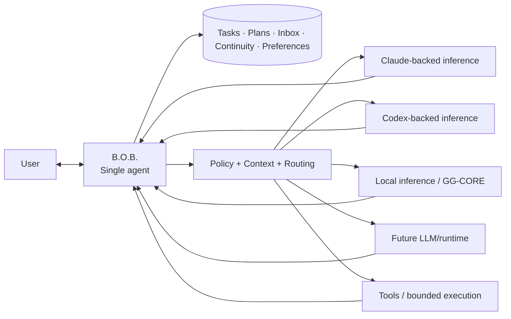
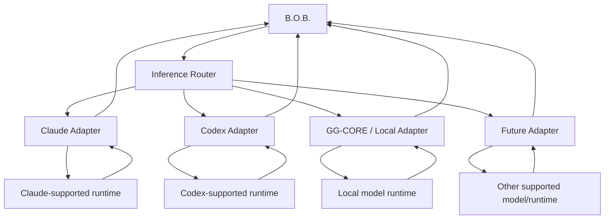
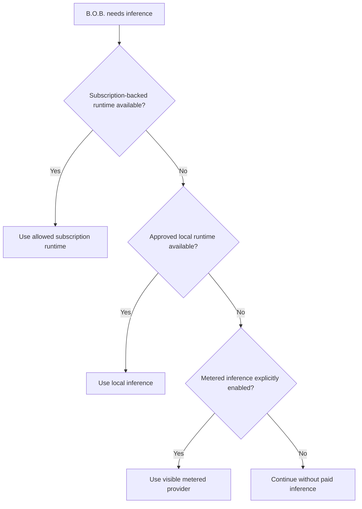
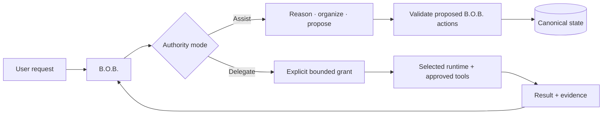
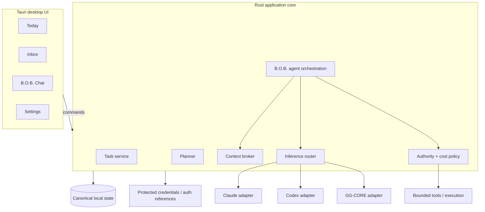
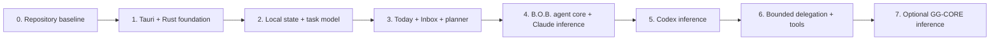

<div align="center">

# B.O.B.

### Better Organized Brain

**One agent. Multiple models and runtimes. One place for the work that matters.**

[](LICENSE)


A local-first, ADHD-friendly personal AI workbench that keeps tasks, plans, context, and continuity in one deliberately simple surface while B.O.B. can use different LLMs, inference runtimes, and tools behind the scenes.

**B.O.B. is the agent. Models, runtimes, and tools are capabilities.**

</div>


> [!IMPORTANT]
> **Current status:** B.O.B. is in pre-alpha revival. The product and architecture baseline is established, but the revived application is not yet runnable from `master`. The retired Electron/Ollama prototype is not part of the active implementation.

## Why B.O.B. exists

Claude, ChatGPT, Codex, local models, and other AI systems are already capable products. B.O.B. is not trying to build weaker copies of them.

The problem is fragmentation. Different tools have different models, sessions, billing systems, permissions, and interfaces. That leaves the user carrying the complexity: deciding what to open, where work lives, what context must be repeated, and which system is supposed to remember what.

B.O.B. deliberately reverses that relationship.

The user talks to **B.O.B.** B.O.B. owns the work and presents one consistent identity. Underneath that single surface, B.O.B. may use Claude, Codex, local inference, or future supported runtimes and tools when they are useful.

The user should not need an architecture diagram in their head to get through Tuesday.

## Product principle

> **Only the things that matter should compete for attention.**

B.O.B. is designed around one point of contact and one durable personal workspace:

- one conversational identity;
- one task and planning system;
- one continuity layer;
- one place to capture what is in your head;
- multiple LLMs and inference runtimes behind the scenes;
- tools and bounded execution when the user intentionally needs them;
- explicit cost and privacy controls;
- useful deterministic planning even when AI is unavailable.

## Architecture in one picture



The models are not peer agents in the product. They are inference and execution capabilities available to **one agent: B.O.B.**

## What using B.O.B. should feel like

B.O.B. starts from the user's day, not from an empty prompt box.

```text
┌──────────────────────────────────────────────────────────────────────┐
│ B.O.B.                                                     Wednesday │
├──────────────────────────────────────────────────────────────────────┤
│ TODAY                                                                │
│                                                                      │
│ What matters                                                        │
│   1. Finish release notes                         45 min             │
│   2. Review pull request                          30 min             │
│   3. Call dentist                                 10 min             │
│                                                                      │
│ NEXT                                                                 │
│   Finish release notes                                              │
│   You have 52 minutes before the next fixed commitment.             │
│                                                                      │
│   [ Start ]   [ Break it down ]   [ Not now ]                       │
│                                                                      │
│ Quick capture: What's in your head? _____________________________    │
│                                                                      │
│ [ Plan my day ] [ Replan ] [ I'm overwhelmed ] [ Ask B.O.B. ]      │
└──────────────────────────────────────────────────────────────────────┘
```

The goal is not to expose everything B.O.B. can do. The goal is to make the **next useful action obvious** while keeping everything else recoverable.

## Four primary surfaces

| Surface | Job | Deliberate constraint |
| --- | --- | --- |
| **Today** | Focus, schedule, next action, quick capture, replanning | Does not become a giant backlog dashboard |
| **Inbox** | Hold unprocessed tasks, ideas, notes, reminders, and brain dumps | Capture first, categorize later |
| **B.O.B. Chat** | Talk to B.O.B., organize work, plan, break down tasks, and request bounded execution | Provider/runtime complexity stays secondary |
| **Settings** | Configure inference, cost policy, accessibility, privacy, and local data behavior | Advanced configuration stays out of the daily workflow |

## ADHD-friendly by interaction design

B.O.B. does not diagnose ADHD, infer cognitive traits, score neurodivergence, or attempt to model the user's brain.

Instead, it uses practical interaction constraints:

- **Capture before organization.** Getting something out of working memory should be cheap.
- **One obvious next action.** Answer “what should I do now?” before exposing secondary choices.
- **Small daily focus.** A few meaningful priorities beat an emergency-shaped backlog.
- **Cheap replanning.** A disrupted day is normal. Replanning is not failure.
- **Progressive disclosure.** Detail appears when it is useful.
- **Interruption recovery.** Preserve context and make resumption obvious.
- **Overwhelm reduction.** Hide nonessential choices and surface one manageable action when needed.
- **Accessible presentation.** Typography, contrast, motion, density, keyboard use, and hierarchy are product requirements.
- **No guilt mechanics.** Productivity data must not become a behavioral scorecard disguised as encouragement.

See [`docs/DESIGN.md`](docs/DESIGN.md) and [`docs/prd/PRD-0002-adhd-friendly-daily-planning.md`](docs/prd/PRD-0002-adhd-friendly-daily-planning.md).

## One agent, multiple inference paths

B.O.B. uses a small internal inference boundary so the product can change models and runtimes without changing the user's agent identity or canonical work state.



An adapter reports what its backend can actually do. B.O.B. remains the user-facing agent regardless of which backend handled a request.

Initial inference priorities are:

| Priority | Backend | Primary value | Cost class |
| --- | --- | --- | --- |
| 1 | **Claude subscription path** | General reasoning, writing, planning, coding, tool-capable work | Subscription-backed |
| 2 | **Codex subscription path** | Coding, repository work, shell-oriented execution | Subscription-backed |
| 3 | **GG-CORE / local** | Private or offline inference | Local compute |
| Later | Other supported models/runtimes | Capability-specific value | Must declare cost class |

Direct metered APIs are not the default inference path.

## Cost is an architectural boundary



> **Subscription first. Local second. Metered only by explicit consent.**

B.O.B. must never silently turn an included subscription workflow into separately billed token usage. Unknown billing behavior fails closed.

See [`docs/governance/AI_COST_AND_PROVIDER_POLICY.md`](docs/governance/AI_COST_AND_PROVIDER_POLICY.md).

## Assist and Delegate are B.O.B. authority levels

The user always delegates to B.O.B. The distinction is about how much authority B.O.B. is allowed to exercise through its selected runtime and tools.



**Assist** is the default. B.O.B. can think, organize, transform, and propose without implicit shell, filesystem, repository, or external-workspace authority.

**Delegate** is explicit. The user gives B.O.B. a bounded task, workspace, capability set, and known cost class. B.O.B. may then use an execution-capable runtime or tool within that boundary.

## Target architecture

The revival targets a small desktop application with a strong native boundary and a web-quality interface.



### Architectural commitments

| Concern | Decision |
| --- | --- |
| User-facing agent | **B.O.B. only** |
| Inference | Multiple LLMs/runtimes behind internal adapters |
| Desktop shell | Tauri 2 target |
| Native application boundary | Rust |
| Frontend | Lightweight TypeScript web UI; framework only if justified |
| Canonical state | Local-first and B.O.B.-owned |
| Normal authority | Assist: reason and propose |
| Delegated authority | Explicit, bounded, inspectable |
| AI availability | Optional for core task/planning behavior |
| Inference cost | Subscription-first; metered opt-in only |
| Local inference | Optional GG-CORE path, not an app prerequisite |
| Local HTTP AI server | Not part of the target architecture |
| Vector database / RAG | Not part of initial revival scope |

The detailed trust boundaries, data flows, and component responsibilities live in [`docs/ARCHITECTURE.md`](docs/ARCHITECTURE.md).

## Current state

**Established:**

- product definition and scope;
- single-agent, multi-LLM architectural model;
- target trust boundaries;
- daily-planning and ADHD-friendly interaction model;
- subscription-first cost policy;
- Assist versus Delegate authority model;
- PRDs, RFCs, ADRs, governance, security, and implementation sequencing.

**Not yet implemented:**

- Tauri application shell;
- canonical local persistence;
- Today and Inbox production surfaces;
- deterministic planner;
- B.O.B. inference router;
- Claude adapter;
- Codex adapter;
- GG-CORE adapter;
- packaging and release automation.

This README will not claim those capabilities until they exist and are verified.

## Implementation sequence



B.O.B. should become a competent task and daily-planning application before inference makes it clever.

See [`docs/IMPLEMENTATION_PLAN.md`](docs/IMPLEMENTATION_PLAN.md) and [`docs/ROADMAP.md`](docs/ROADMAP.md).

## Repository layout

```text
B.O.B./
├── .github/        GitHub templates, contribution, conduct, support, and security policy
├── docs/           Product, architecture, design, governance, decision records, and assets
├── .gitignore      Repository ignore rules
├── AGENTS.md       Binding instructions for coding agents
├── LICENSE         MIT license
└── README.md       Product and repository front door
```

Historical implementation code is not kept in the active tree merely because it once existed. Git already has a memory. It does not need every abandoned experiment sitting in the foyer.

## Documentation map

| Need | Start here |
| --- | --- |
| Understand the product | [`docs/PRODUCT.md`](docs/PRODUCT.md) |
| Understand the system | [`docs/ARCHITECTURE.md`](docs/ARCHITECTURE.md) |
| Understand the user experience | [`docs/DESIGN.md`](docs/DESIGN.md) |
| See implementation order | [`docs/IMPLEMENTATION_PLAN.md`](docs/IMPLEMENTATION_PLAN.md) |
| See release direction | [`docs/ROADMAP.md`](docs/ROADMAP.md) |
| Review product requirements | [`docs/prd/`](docs/prd/) |
| Review implementation proposals | [`docs/rfc/`](docs/rfc/) |
| Review durable decisions | [`docs/adr/`](docs/adr/) |
| Review governance | [`docs/governance/`](docs/governance/) |
| Understand legacy history | [`docs/legacy/`](docs/legacy/) |
| See documentation traceability | [`docs/TRACEABILITY.md`](docs/TRACEABILITY.md) |
| Contribute | [`.github/CONTRIBUTING.md`](.github/CONTRIBUTING.md) |
| Review security model | [`.github/SECURITY.md`](.github/SECURITY.md) |

The full documentation index is [`docs/README.md`](docs/README.md).

## Deliberate non-goals

The initial revival does **not** include:

- a visible multi-agent swarm or agent roster;
- cognitive profiling or inferred neurodivergence scoring;
- medical or diagnostic guidance;
- a proprietary foundation model;
- an Ollama dependency;
- a bundled vector database or general-purpose RAG knowledge center;
- ambient autonomous execution authority;
- silent metered API fallback;
- cloud sync or multi-user collaboration;
- a plugin marketplace;
- generalized project-management software;
- rebuilding vendor-specific AI applications feature for feature.

New scope must justify why B.O.B. should own it instead of letting an existing runtime or tool provide the capability behind B.O.B.'s unified surface.

## Legacy preservation

The original Electron/Ollama-era implementation and related experiments are preserved in Git history and on `archive/pre-revival-cleanup-2026-08-19`. That material is historical evidence, not a supported release line or architectural authority.

See [`docs/legacy/README.md`](docs/legacy/README.md).

## Governance, contribution, and validation

B.O.B. is intentionally small, but small does not mean undocumented.

Material changes are traceable through PRDs, RFCs, and ADRs. Implementation must agree with accepted records. If a decision changes, supersede the record rather than quietly rewriting history.

GitHub Actions and required CI gates are intentionally minimal. The implementing developer or coding agent is responsible for relevant builds, tests, linting, type checks, targeted integration checks, and manual validation before requesting review, then recording that evidence in the pull request.

Project governance is documented in [`docs/governance/GOVERNANCE.md`](docs/governance/GOVERNANCE.md). Coding-agent requirements are binding in [`AGENTS.md`](AGENTS.md).

## Privacy and security posture

B.O.B. is local-first, not local-only.

Canonical personal state remains local by default. Remote inference receives bounded context intentionally. Credentials do not belong in frontend code, logs, prompts, or ordinary local state. Model output is untrusted until validated. Filesystem and shell authority require an explicit delegated boundary.

Security reporting and the current security contract are documented in [`.github/SECURITY.md`](.github/SECURITY.md).

## License

B.O.B. is open source under the [MIT License](LICENSE). Use it, learn from it, adapt it, and build something useful.

---

<div align="center">

### Better Organized Brain

**One agent. Less friction. The right intelligence when it matters.**

</div>
