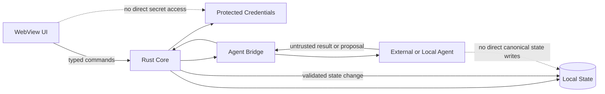

# Security Policy

## Security model

B.O.B. is a local-first desktop application that may invoke local or remote AI agents. The primary security objective is to preserve a narrow trust boundary between the user interface, application state, credentials, external agents, and optional delegated workspaces.

## Core rules

- Renderer/UI code must not receive unrestricted native, filesystem, shell, or credential authority.
- Secrets must be stored using platform-appropriate protected storage when available and must never be written to ordinary application logs.
- Agent bridges receive only the context and workspace authority required for a specific request.
- Agent output is untrusted input until B.O.B. validates any proposed application action.
- Normal planning/chat mode must not implicitly grant filesystem or shell execution.
- Delegated execution must identify the bounded workspace and permissions being granted.
- Metered inference endpoints are disabled unless explicitly enabled by the user.
- Local state should remain readable, exportable, and recoverable without a model vendor.

## Trust boundary

## Vulnerability reporting

Until a public security contact is established, vulnerabilities should be reported privately to the repository owner through an appropriate private channel. Do not open public vulnerability details if the repository becomes public before a disclosure process is documented.

## Supported versions

The revived implementation has not yet reached a supported release. Security support policy will be defined before the first public release candidate.
