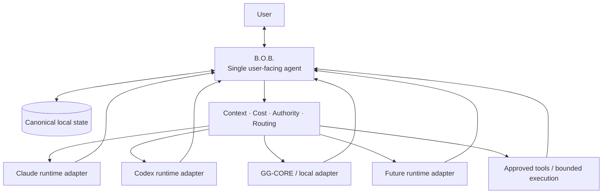
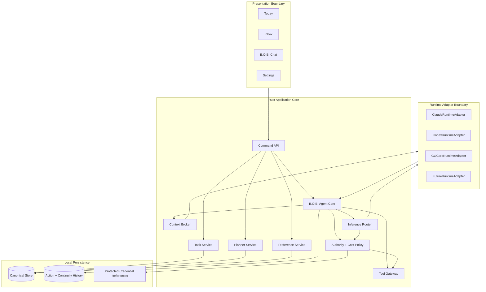
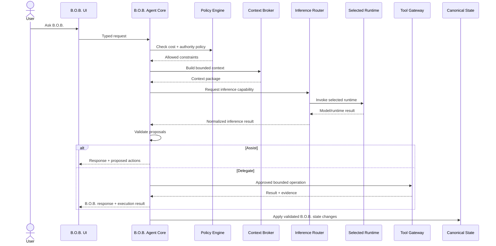
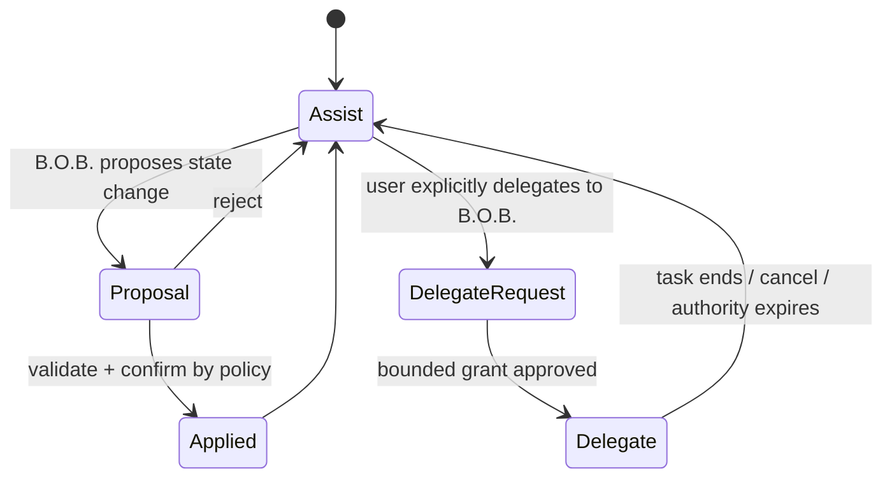

# Target Architecture

**Status:** Accepted  
**Related RFCs:** RFC-0001, RFC-0002, RFC-0003

## Architectural objective

Build the smallest desktop architecture that can present **one coherent B.O.B. agent**, safely own local personal state, and draw on multiple LLMs, inference runtimes, and tools without exposing that back-end complexity as the user's interaction model.

The target is a Tauri 2 desktop shell with a Rust application core and a lightweight web frontend.

## Core invariant

> **B.O.B. is the agent. Models, inference runtimes, and tools are capabilities behind B.O.B.**

Claude, Codex, GG-CORE, local models, and future providers may supply reasoning, generation, or execution capabilities. They are not peer agents in the product architecture.

The user has one point of contact: B.O.B.

## System context



B.O.B. is the product identity and system of record. Runtime adapters provide capabilities.

## Logical architecture



## Layer responsibilities

### Presentation boundary

The frontend renders B.O.B. state and sends typed commands. It does not receive unrestricted filesystem, process, shell, or credential access.

The UI should expose provider/runtime detail only when useful for explicit choice, cost, privacy, capability, or troubleshooting. Ordinary interaction remains with B.O.B.

### B.O.B. Agent Core

The B.O.B. Agent Core is the single user-facing agent orchestration boundary. It owns:

- conversational identity and response assembly;
- intent interpretation;
- selection or honoring of inference preferences;
- context requests;
- proposal handling;
- coordination with deterministic task/planning services;
- authority transitions between Assist and Delegate;
- result/evidence presentation.

It does not surrender canonical state ownership to an underlying runtime.

### Deterministic application services

The Rust core owns deterministic business behavior:

- item lifecycle;
- daily planning and schedule operations;
- persistence orchestration;
- export and migration;
- proposal validation;
- authority and cost enforcement.

These services remain usable when no LLM is available.

### Inference router

The inference router selects an allowed runtime adapter based on explicit user choice, configured default, availability, cost policy, privacy constraints, and required capabilities.

Initial releases do not require opaque model scoring or autonomous optimization. A simple default plus explicit override is sufficient.

### Runtime adapters

Runtime adapters normalize supported inference/execution backends to one internal contract. They do not become B.O.B.'s user-facing identity and do not own product state.

An adapter reports:

- availability;
- authentication state where safely observable;
- model/runtime identity;
- capabilities;
- billing class;
- invocation status;
- structured result;
- cancellation when supported.

### Tool gateway

Tools are separate capabilities from the LLM/runtime identity. The tool gateway enforces allowlisted, typed operations and bounded external authority.

In Assist mode, tool authority is minimal or absent. In Delegate mode, B.O.B. may receive a specific, visible grant for a task/workspace/capability set.

### Persistence

Persistence is local-first and single-user. It must support schema versioning, atomic recovery, export, and migration.

## Request flow



The user never changes conversational identity during this flow.

## Canonical state boundary

```text
+------------------------------------------------------------------+
|                              B.O.B.                              |
|                                                                  |
|  Identity  Tasks  Plans  Inbox  Preferences  Working Continuity |
|      \       |      |      |        |             /             |
|       +------+------+-+----+--------+------------+              |
|                         |                                        |
|                  Canonical Local State                          |
|                         |                                        |
|             B.O.B. Context + Policy Boundary                    |
+-------------------------|----------------------------------------+
                          |
             selected capability, not identity
                          |
          +---------------+----------------+----------------+
          |               |                |                |
      Claude runtime   Codex runtime   Local runtime      Tools
          |               |                |                |
      non-canonical    non-canonical    non-canonical    bounded
        backend          backend          backend        authority
```

## State domains

### Item

Minimum conceptual fields:

- `id`
- `type`: task, idea, note, reminder
- `title`
- `notes`
- `status`: inbox, planned, doing, done, deferred, archived
- `priority`: low, normal, high
- `estimateMinutes`
- `dueAt`
- `energy`: optional low, medium, high
- `tags`
- `createdAt`
- `updatedAt`

### DayPlan

A day plan owns:

- date;
- focus item IDs, maximum three by default;
- ordered blocks;
- optional day start and end;
- optional capacity constraints;
- generated/replanned metadata sufficient to explain the current plan.

### ConversationContinuity

B.O.B. stores compact continuity needed to preserve the one-agent experience across runtime changes, such as:

- B.O.B. conversation/thread identity;
- current user intent;
- relevant work/task associations;
- compact summaries;
- runtime used for an inference turn when useful for inspection;
- returned proposals and outcomes.

Vendor/runtime transcripts are not required to become canonical state.

## Authority model

Authority belongs to B.O.B., not directly to whichever runtime supplied inference.



### Assist

B.O.B. may reason, summarize, transform, and propose using an allowed runtime. Assist cannot implicitly grant shell, filesystem, repository, or broad external authority.

### Delegate

The user grants B.O.B. a bounded task/workspace/capability set. B.O.B. may use an execution-capable runtime and/or tool gateway within that grant.

## Cost-policy boundary

Every runtime adapter declares one billing class:

- `subscription`
- `local`
- `metered`
- `unknown`

Unknown is blocked until classified. Metered inference is disabled by default.

Authentication mechanism alone does not determine billing class.

## Failure behavior

B.O.B. must degrade safely:

- selected runtime unavailable: use another allowed runtime only according to policy or continue without AI;
- subscription allowance exhausted: offer another subscription/local path or wait state;
- local inference unavailable: deterministic B.O.B. remains operational;
- invalid model proposal: reject without changing canonical state;
- persistence interruption: recover the last valid version or backup;
- runtime crash: isolate failure from canonical state;
- tool failure: return evidence/status without silently widening authority.

## Technology boundaries

Target direction:

- Tauri 2 desktop shell;
- Rust application core;
- lightweight TypeScript web frontend;
- one B.O.B. agent identity;
- internal inference/runtime adapter boundary;
- separate bounded tool gateway;
- no required local HTTP inference server;
- no required Python runtime;
- no required vector database;
- no direct UI access to native secrets or shell;
- optional GG-CORE Rust integration when appropriate for the required path.

The frontend framework should remain minimal and be justified by actual state/interaction complexity.
