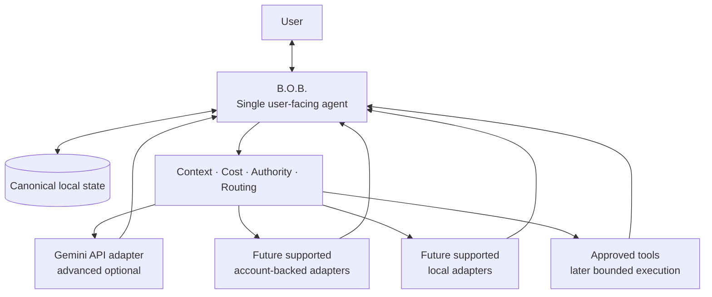
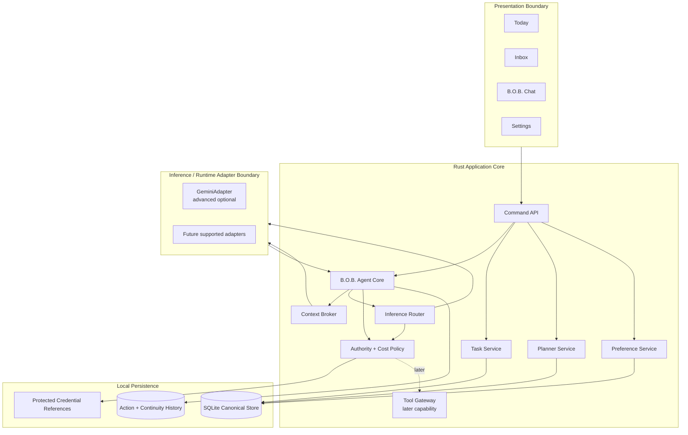
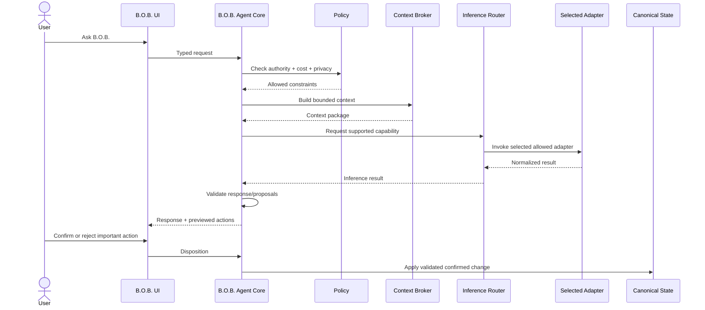

# Target Architecture

**Status:** Accepted  
**Related RFCs:** RFC-0001, RFC-0002, RFC-0003

## Architectural objective

Build the smallest desktop architecture that presents one coherent B.O.B. agent, safely owns local personal state, and can draw on multiple inference runtimes and tools over time without exposing backend complexity as the user's interaction model.

The current desktop architecture is a Tauri 2 shell with a Rust application core and a framework-free TypeScript + Vite frontend. Windows 11 x64 is the primary supported platform for the current runnable waypoint.

The first-alpha Gemini Developer API Free path proved the inference, credential, privacy, billing, and failure-policy seams. It remains an advanced optional adapter. Current Wayfinder direction is provider-independent: future account-backed and local paths must fit behind B.O.B.-owned routing, state, continuity, authority, and cost policy rather than redefining the application around any provider.

## Core invariant

> **B.O.B. is the agent. Models, inference runtimes, provider APIs/CLIs, and tools are capabilities behind B.O.B.**

The user has one point of contact: B.O.B. Removing any single inference adapter must leave B.O.B. buildable, launchable, state-safe, and usefully deterministic.

## System context



B.O.B. is the product identity and system of record. Inference/runtime adapters provide replaceable capabilities.

## Logical architecture



## Layer responsibilities

### Presentation boundary

The frontend renders B.O.B. state and sends typed commands. It does not receive unrestricted filesystem, process, shell, database, or credential access.

Provider/runtime detail is exposed only when useful for explicit configuration, cost, privacy, capability, or troubleshooting. Ordinary interaction remains with B.O.B. Settings must not make provider plumbing the product identity.

### B.O.B. Agent Core

The B.O.B. Agent Core is the single user-facing orchestration boundary. The accepted #34 contract gives it responsibility for:

- conversational identity and response assembly;
- intent interpretation;
- bounded context assembly;
- inference routing and policy coordination;
- proposal validation;
- deterministic-service coordination;
- compact continuity and failure handling;
- result/evidence presentation.

It does not surrender canonical state ownership to an underlying runtime. Model/runtime output is untrusted until B.O.B. validates it. Important state-changing proposals are previewed before application.

### Deterministic application services

The Rust core owns deterministic business behavior, including item lifecycle, planning, persistence orchestration, export/migration, proposal validation, preference handling, and authority/cost enforcement. These services remain useful when no inference runtime is available.

### Inference router

The inference router selects only allowed capabilities according to supported configuration, explicit user choice where applicable, availability, auth state, billing classification, privacy constraints, and required capability.

Authentication method does not imply billing class. Unknown billing classification fails closed. Provider/model changes that materially affect cost, privacy, or user intent never happen silently.

The router must not become a speculative universal provider framework. Normalize only the fields and lifecycle behavior required by supported adapters.

### Inference/runtime adapters

Adapters normalize supported inference backends to narrow internal contracts. They do not become B.O.B.'s user-facing identity and do not own product state.

An adapter may report, where supported:

- availability;
- authentication state;
- runtime/model identity;
- capabilities;
- billing class;
- invocation status;
- structured result;
- cancellation.

Gemini Developer API is the currently implemented cloud adapter and remains subject to its accepted professional/business-use, unpaid-service data-use, secret, and billing boundaries. Account-backed and local adapters remain governed by Wayfinder #79 and must not be invented ahead of accepted authority.

### Tool gateway

Tools are separate capabilities from inference/runtime identity. Future Delegate behavior may add bounded execution authority through explicit user grants. Ordinary Assist requests do not inherit shell, filesystem, repository, or broad external permissions.

### Persistence

Persistence is local-first and single-user. The accepted contract is:

- one SQLite database owned exclusively by the Rust core as canonical ordinary application state;
- every logical state change commits transactionally or not at all;
- Rust owns immutable monotonic migrations and startup compatibility checks;
- schema-changing migrations create SQLite-consistent safety copies and fail closed on open/migration failure;
- B.O.B. retains bounded known-good recovery snapshots;
- ordinary crash consistency relies on SQLite rather than custom shadow-file logic;
- backup/restore uses SQLite-consistent snapshots with fail-closed rollback;
- portable export is a documented versioned JSON package of user-owned non-secret state;
- credentials remain in the OS secret store, with SQLite limited to non-secret references/status;
- corruption or migration failure never silently resets user data.

The SQLite schema owns ordinary product state, not an open-ended advanced memory subsystem. Richer governed-memory behavior should preferentially integrate later with `MythologIQ-Labs-LLC/agent-memory` through an explicit contract.

See ADR-0004 and RFC-0003.

## Request flow



The user never changes conversational identity during this flow. Inference failure leaves deterministic B.O.B. behavior available.

## Canonical state boundary

```text
+------------------------------------------------------------------+
|                              B.O.B.                              |
|                                                                  |
|  Identity  Tasks  Plans  Inbox  Preferences  Working Continuity |
|      \       |      |      |        |             /             |
|       +------+------+-+----+--------+------------+              |
|                         |                                        |
|                  Canonical Local State                          |
|                         |                                        |
|             B.O.B. Context + Policy Boundary                    |
+-------------------------|----------------------------------------+
                          |
                selected capability, not identity
                          |
          +---------------+----------------+----------------+
          |                                |                |
   Gemini API adapter            Account-backed paths   Local paths
   advanced optional             when supported         when accepted
          |                                |                |
   non-canonical backend          non-canonical          non-canonical
```

## State domains

### Item

Minimum conceptual fields include `id`, `type`, `title`, `notes`, lifecycle `status`, `priority`, estimate, due time, optional energy, tags, and creation/update timestamps.

### DayPlan

A day plan owns its date, up to three default focus items, ordered blocks, optional day bounds/capacity, and enough generated/replanned metadata to explain the current plan.

### ConversationContinuity

B.O.B. stores compact continuity needed to preserve the one-agent experience across restart and runtime changes: conversation/thread identity, current intent, relevant work associations, compact summaries, runtime identity when useful, and returned proposals/outcomes. Vendor/runtime transcripts are not canonical state by default.

## Authority model

Authority belongs to B.O.B., not whichever runtime supplied inference. Assist may reason, summarize, organize, transform, and propose using an allowed adapter. Important state changes remain validated and previewed before application. Future Delegate behavior requires a separate bounded grant.

## Cost-policy boundary

Every inference/runtime adapter declares one billing class: `free`, `subscription`, `local`, `metered`, or `unknown`.

Unknown is blocked until classified. Metered inference is disabled by default and requires explicit user enablement. Authentication mechanism alone does not determine billing class.

The implemented Gemini API path is an advanced optional adapter with its own accepted provider-purpose/data-use and Free-Tier confirmation boundary. Future account-backed/local paths must preserve the same no-surprise-billing invariant.

See `docs/governance/AI_COST_AND_PROVIDER_POLICY.md`.

## Failure behavior

B.O.B. degrades safely:

- inference unavailable: deterministic B.O.B. remains operational;
- quota/auth/provider/network failure: no silent paid or different-provider fallback;
- invalid model proposal: reject without changing canonical state;
- persistence interruption: preserve user data and follow ADR-0004/RFC-0003 recovery semantics;
- runtime/provider failure: isolate failure from canonical state;
- future tool failure: return evidence/status without widening authority.

## Technology boundaries

Current direction:

- Tauri 2 desktop shell;
- Rust privileged application core;
- framework-free TypeScript + Vite frontend;
- Windows 11 x64 primary platform;
- one B.O.B. agent identity;
- Rust-owned SQLite canonical ordinary-state store;
- OS-backed secret-store boundary;
- provider-independent inference/runtime seams;
- Gemini Developer API as an advanced optional current adapter;
- no required local HTTP inference server, Python runtime, vector database, peer-agent UX, or mandatory provider client;
- no direct UI access to native secrets, database, shell, or arbitrary filesystem;
- no competing advanced-memory subsystem inside ordinary SQLite state.

Future account-backed adapters, local inference, governed-memory integration, and bounded tools may extend these seams only when authorized by later product/architecture decisions.