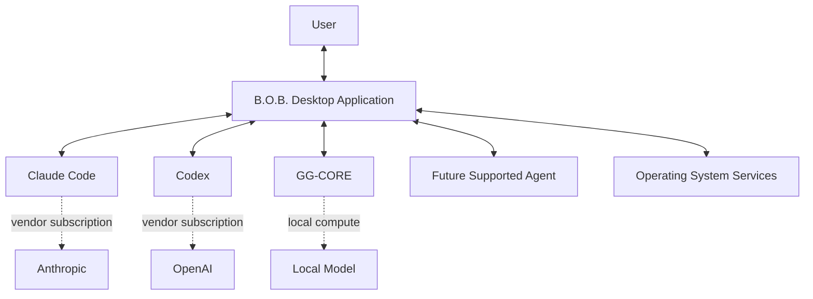
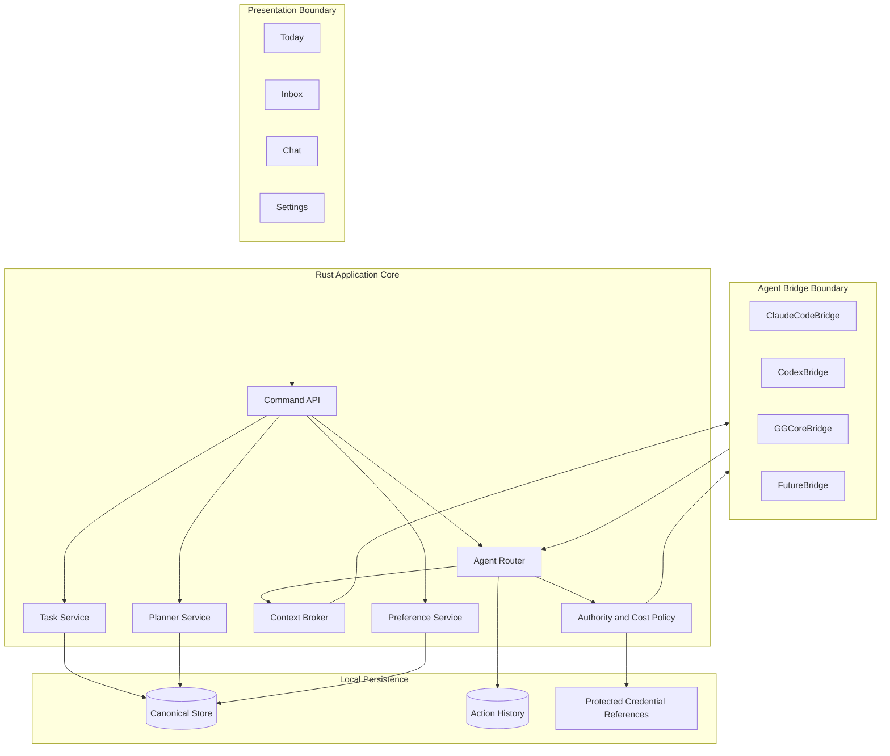
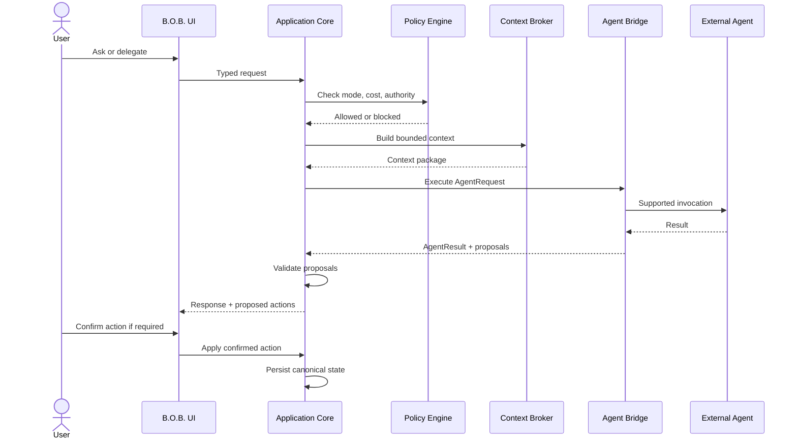
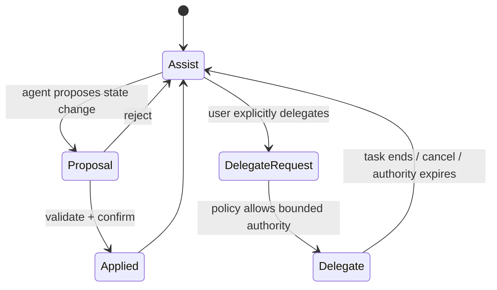

# Target Architecture

**Status:** Proposed  
**Related RFCs:** RFC-0001, RFC-0002, RFC-0003

## Architectural objective

Build the smallest desktop architecture that can safely own local personal state, present a high-quality web-style interface, and integrate multiple local or subscription-backed agent surfaces without making any agent vendor the application runtime.

The proposed target is a Tauri 2 desktop shell with a Rust application core and a lightweight web frontend. The Tauri decision becomes authoritative only when RFC-0001 and ADR-0002 are accepted.

## System context



B.O.B. is the system of record. External agents are capabilities invoked through explicit bridges.

## Logical architecture



## Layer responsibilities

### Presentation boundary

The frontend renders state and sends typed commands. It does not receive unrestricted filesystem, process, shell, or credential access.

### Application core

The Rust core owns deterministic business behavior:

- item lifecycle;
- daily planning and schedule operations;
- agent bridge invocation;
- context selection;
- proposal validation;
- authority and cost policy;
- persistence orchestration;
- export and migration.

### Persistence

The first implementation should prefer a simple local store appropriate for one user and one desktop process. The exact persistence mechanism is decided in RFC-0003. Persistence must support schema versioning, atomic recovery, export, and migration.

### Agent bridges

Agent bridges adapt supported vendor or local agent interfaces to one internal contract. They do not own product state.

A bridge reports:

- availability;
- authentication state where safely observable;
- capabilities;
- billing class;
- invocation status;
- structured result;
- cancellation capability when supported.

## Agent request flow



## Canonical state boundary

```text
+------------------------------------------------------+
|                     B.O.B.                           |
|                                                      |
|  Tasks  Plans  Inbox  Preferences  Working Context  |
|       \     |      |      |          /              |
|        +----+------+------+-+--------+               |
|                         |                            |
|                Canonical Local State                |
+-------------------------|----------------------------+
                          |
                    bounded context
                          |
          +---------------+----------------+
          |               |                |
       Claude           Codex           GG-CORE
          |               |                |
     non-canonical    non-canonical    non-canonical
       sessions         sessions         execution
```

## State domains

### Item

Minimum conceptual fields:

- `id`
- `type`: task, idea, note, reminder
- `title`
- `notes`
- `status`: inbox, planned, doing, done, deferred, archived
- `priority`: low, normal, high
- `estimateMinutes`
- `dueAt`
- `energy`: optional low, medium, high
- `tags`
- `createdAt`
- `updatedAt`

### DayPlan

A day plan owns:

- date;
- focus item IDs, maximum three by default;
- ordered blocks;
- optional day start and end;
- optional capacity constraints;
- generated/replanned metadata sufficient to explain the current plan.

Blocks may represent tasks, fixed commitments, breaks, or intentionally open time.

### AgentSessionRecord

B.O.B. stores only the continuity needed for the product, such as provider, timestamps, task/workspace association, compact summary, and returned proposals. Vendor transcripts are not required to become canonical unless a later PRD explicitly requires it.

## Authority model

Normal chat operates in Assist mode. Assist mode cannot implicitly grant shell or filesystem authority.

Delegate mode requires a bounded task and explicit workspace/capability grant.



## Cost-policy boundary

Every bridge declares one billing class:

- `subscription`
- `local`
- `metered`
- `unknown`

Unknown is treated as blocked until configured. Metered bridges are disabled by default.

A bridge may never relabel metered usage as subscription usage merely because authentication uses OAuth.

## Failure behavior

B.O.B. must degrade safely:

- agent unavailable: deterministic planning and task management remain available;
- subscription allowance exhausted: offer another allowed bridge or wait state;
- local model unavailable: remain operational without local inference;
- invalid agent proposal: reject without changing canonical state;
- persistence interruption: recover the last valid version or backup;
- bridge crash: isolate failure from canonical state.

## Technology boundaries

Target direction:

- Tauri 2 desktop shell;
- Rust application core;
- lightweight TypeScript web frontend;
- no required local HTTP inference server;
- no required Python runtime;
- no required vector database;
- no direct UI access to native secrets or shell;
- optional GG-CORE Rust integration when mature enough for the required path.

Framework choice inside the frontend should remain minimal. A component framework is justified only by demonstrated state and interaction complexity.
