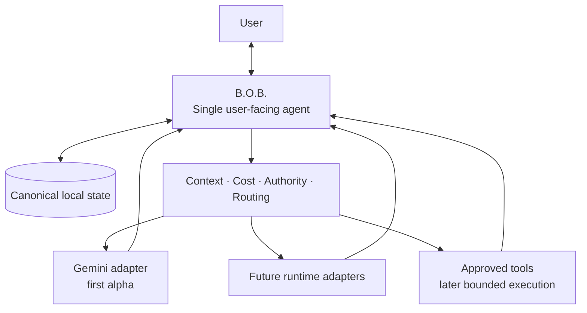
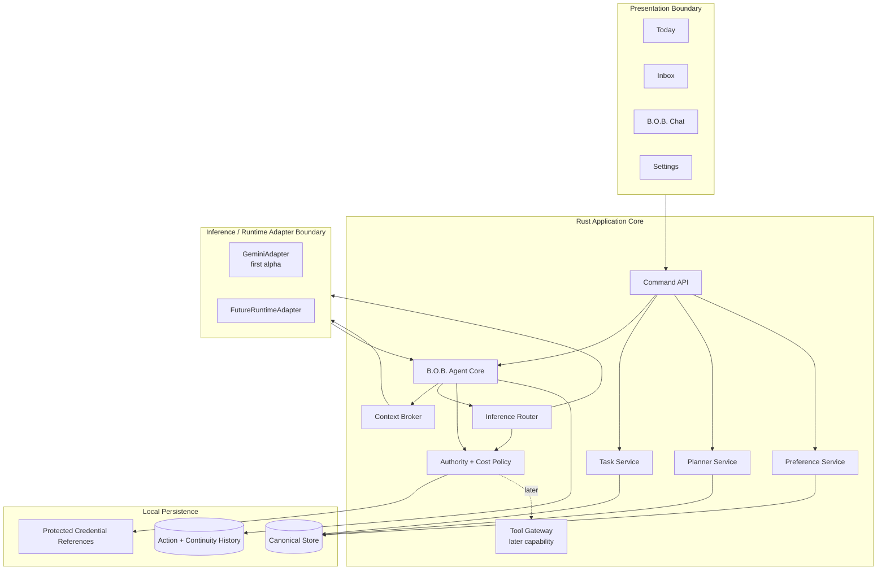
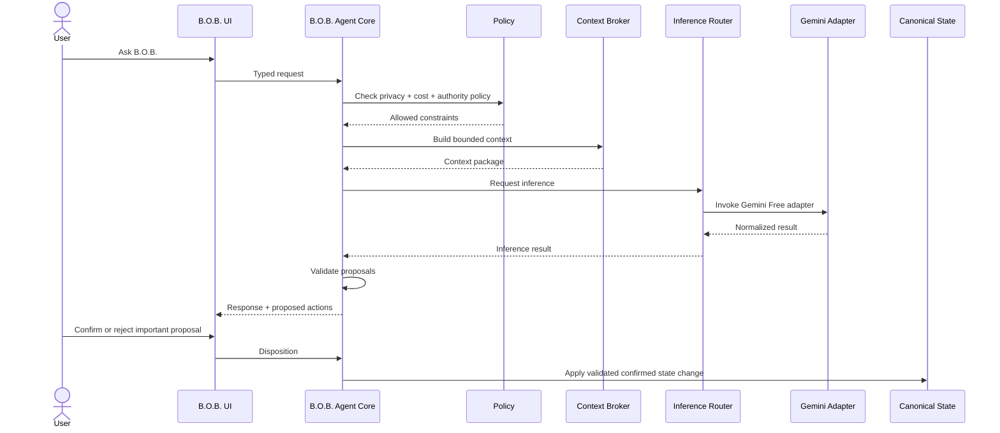

# Target Architecture

**Status:** Accepted  
**Related RFCs:** RFC-0001, RFC-0002, RFC-0003

## Architectural objective

Build the smallest desktop architecture that can present **one coherent B.O.B. agent**, safely own local personal state, and draw on multiple LLMs, inference runtimes, and tools over time without exposing that back-end complexity as the user's interaction model.

The target is a Tauri 2 desktop shell with a Rust application core and a lightweight TypeScript frontend.

For the first runnable alpha, the resolved Wayfinder route narrows that target to Windows 11 x64, framework-free TypeScript + Vite, Gemini Developer API Free as the sole required inference backend, and bounded Assist behavior. Additional inference/runtime adapters, local inference, and Delegate/tool execution remain later expansion paths.

## Core invariant

> **B.O.B. is the agent. Models, inference runtimes, and tools are capabilities behind B.O.B.**

Gemini, future Claude/Codex account-backed paths, local models, and approved tools may supply reasoning, generation, or later execution capabilities. They are not peer agents in the product architecture.

The user has one point of contact: B.O.B.

## System context



B.O.B. is the product identity and system of record. Inference/runtime adapters provide capabilities.

## Logical architecture



## Layer responsibilities

### Presentation boundary

The frontend renders B.O.B. state and sends typed commands. It does not receive unrestricted filesystem, process, shell, database, or credential access.

The UI should expose provider/runtime detail only when useful for explicit choice, cost, privacy, capability, or troubleshooting. Ordinary interaction remains with B.O.B.

### B.O.B. Agent Core

The B.O.B. Agent Core is the single user-facing agent orchestration boundary. It owns:

- conversational identity and response assembly;
- intent interpretation;
- selection or honoring of supported inference preferences;
- context requests;
- proposal handling;
- coordination with deterministic task/planning services;
- result/evidence presentation;
- later authority transitions when bounded Delegate behavior is implemented.

It does not surrender canonical state ownership to an underlying runtime.

The exact first-alpha agent-core and routing contract remains governed by the active Wayfinder decision ticket until resolved.

### Deterministic application services

The Rust core owns deterministic business behavior:

- item lifecycle;
- daily planning and schedule operations;
- persistence orchestration;
- export and migration;
- proposal validation;
- authority and cost enforcement.

These services remain usable when no LLM is available.

### Inference router

The inference router selects an allowed inference/runtime adapter according to the active product boundary, explicit user choice where supported, configured default, availability, cost policy, privacy constraints, and required capabilities.

The first alpha has one required adapter, Gemini Developer API Free, so routing can remain deliberately simple. Future releases may add more adapters without changing B.O.B.'s user-facing identity.

Opaque model scoring or autonomous optimization is not required.

### Inference/runtime adapters

Adapters normalize supported inference/execution backends to one internal contract. They do not become B.O.B.'s user-facing identity and do not own product state.

An adapter may report, as appropriate to its supported surface:

- availability;
- authentication state where safely observable;
- model/runtime identity;
- capabilities;
- billing class;
- invocation status;
- structured result;
- cancellation when supported.

The exact normalized first-alpha contract remains governed by the active Wayfinder agent-core/runtime decision until resolved.

### Tool gateway

Tools are separate capabilities from the inference/runtime identity. A future tool gateway will enforce allowlisted, typed operations and bounded external authority.

Delegate/tool execution is not a first-alpha requirement. The alpha must preserve a clean seam for later bounded authority without granting ordinary Assist chat shell, filesystem, repository, or broad external permissions.

### Persistence

Persistence is local-first and single-user. It must support schema versioning, recovery, export, migration, and separation of protected credentials from ordinary state.

The exact first-alpha store and recovery contract remains governed by the active Wayfinder persistence decision until owner disposition.

## First-alpha request flow



The user never changes conversational identity during this flow. Inference failure leaves deterministic B.O.B. behavior available.

## Canonical state boundary

```text
+------------------------------------------------------------------+
|                              B.O.B.                              |
|                                                                  |
|  Identity  Tasks  Plans  Inbox  Preferences  Working Continuity |
|      \       |      |      |        |             /             |
|       +------+------+-+----+--------+------------+              |
|                         |                                        |
|                  Canonical Local State                          |
|                         |                                        |
|             B.O.B. Context + Policy Boundary                    |
+-------------------------|----------------------------------------+
                          |
             selected capability, not identity
                          |
               +----------+-----------+
               |                      |
          Gemini adapter      Future adapters/tools
          first alpha          later capabilities
               |                      |
          non-canonical           non-canonical
            backend                capability
```

## State domains

### Item

Minimum conceptual fields:

- `id`
- `type`: task, idea, note, reminder
- `title`
- `notes`
- `status`: inbox, planned, doing, done, deferred, archived
- `priority`: low, normal, high
- `estimateMinutes`
- `dueAt`
- `energy`: optional low, medium, high
- `tags`
- `createdAt`
- `updatedAt`

### DayPlan

A day plan owns:

- date;
- focus item IDs, maximum three by default;
- ordered blocks;
- optional day start and end;
- optional capacity constraints;
- generated/replanned metadata sufficient to explain the current plan.

### ConversationContinuity

B.O.B. stores compact continuity needed to preserve the one-agent experience across restart and future runtime changes, such as:

- B.O.B. conversation/thread identity;
- current user intent;
- relevant work/task associations;
- compact summaries;
- runtime used for an inference turn when useful for inspection;
- returned proposals and outcomes.

Vendor/runtime transcripts are not required to become canonical state.

## Authority model

Authority belongs to B.O.B., not directly to whichever runtime supplied inference.

For the first alpha, Assist behavior is the implemented authority boundary: B.O.B. may reason, summarize, organize, transform, and propose using an allowed inference adapter, but important application changes remain validated and previewed before application.

Future Delegate behavior may add bounded execution authority through an explicit user grant. That future seam must not cause ordinary alpha Assist requests to inherit tool or coding-agent permissions.

## Cost-policy boundary

Every inference/runtime adapter declares one billing class:

- `free`
- `subscription`
- `local`
- `metered`
- `unknown`

Unknown is blocked until classified. Metered inference is disabled by default.

Authentication mechanism alone does not determine billing class.

The first-alpha Gemini Developer API Free path is classified `free` for the supported integration surface and remains subject to provider quota, eligibility, and privacy/data-use policy. Quota exhaustion or provider failure does not silently transition the user into paid inference.

See `docs/governance/AI_COST_AND_PROVIDER_POLICY.md` for the durable policy.

## Failure behavior

B.O.B. must degrade safely:

- first-alpha inference unavailable: deterministic B.O.B. remains operational;
- free quota exhausted: remain non-metered and explain the available next step;
- invalid or missing credential: do not send inference requests and preserve deterministic operation;
- invalid model proposal: reject without changing canonical state;
- persistence interruption: follow the resolved persistence/recovery contract and never silently reset user state;
- runtime/provider failure: isolate failure from canonical state;
- future tool failure: return evidence/status without silently widening authority.

## Technology boundaries

First-alpha direction:

- Tauri 2 desktop shell;
- Rust privileged application core;
- framework-free TypeScript + Vite frontend;
- Windows 11 x64 primary support;
- one B.O.B. agent identity;
- Gemini Developer API Free first inference adapter;
- internal inference/runtime adapter boundary;
- protected OS secret-store boundary;
- no required local HTTP inference server;
- no required Python runtime;
- no required vector database;
- no direct UI access to native secrets, database, shell, or arbitrary filesystem;
- no required local inference runtime;
- no required second backend;
- no first-alpha Delegate/tool execution.

Future adapters and bounded tools may extend these seams only when authorized by later product/architecture decisions.
