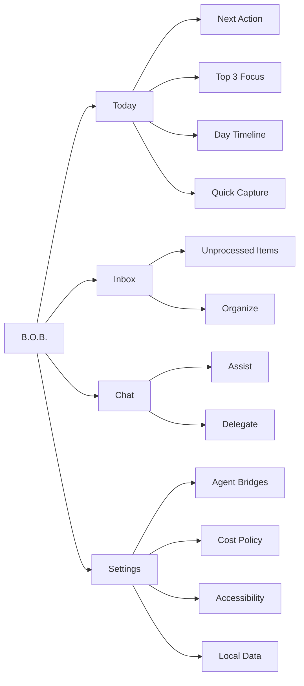
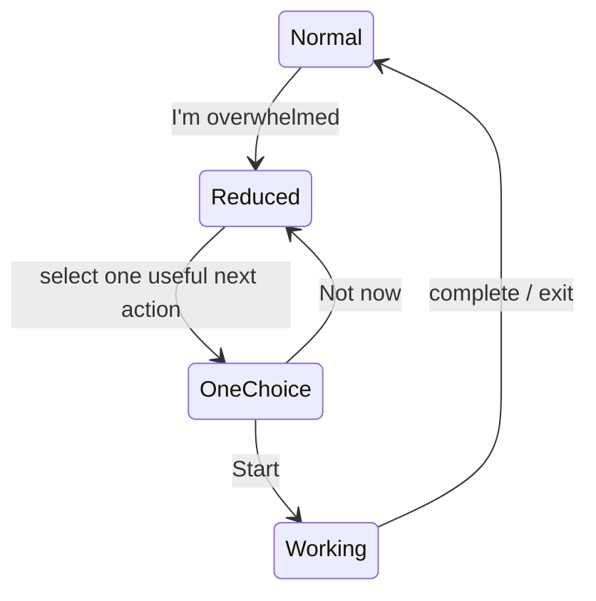
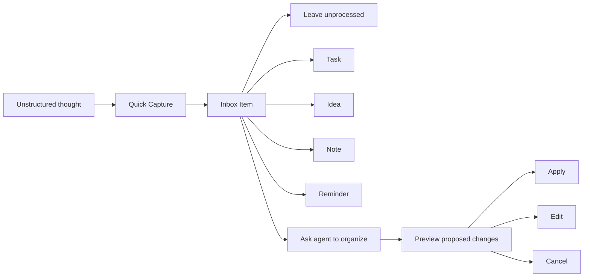
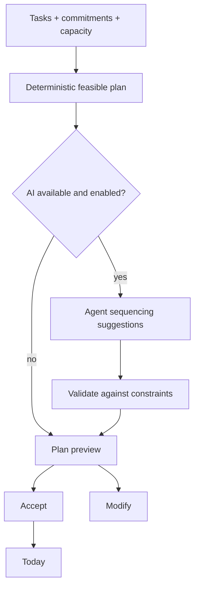

# Interaction and Information Design

**Status:** Proposed

## Design objective

The interface should reduce the number of decisions required to begin useful work. B.O.B. should feel like a calm control surface, not an analytics dashboard and not a blank chatbot.

## Information architecture



The top-level navigation intentionally stays small. New top-level surfaces require a PRD because every new destination creates another place the user must remember to check.

## Today surface

Conceptual desktop layout:

```text
+------------------------------------------------------------------+
| B.O.B.                                      [Claude] [Settings]   |
+------------------------------------------------------------------+
| Good morning.                                                     |
|                                                                  |
| NEXT                                                             |
| +--------------------------------------------------------------+ |
| | Finish release notes                             ~45 min     | |
| | You have 52 minutes before the next commitment.              | |
| | [Start]  [Break it down]  [Not now]                          | |
| +--------------------------------------------------------------+ |
|                                                                  |
| TODAY'S FOCUS                    TIMELINE                         |
| 1. Finish release notes          09:00  Release notes            |
| 2. Call dentist                  10:00  Open                      |
| 3. Review PR                     11:00  Appointment               |
|                                  12:00  Lunch                     |
|                                                                  |
| QUICK CAPTURE                                                     |
| [ What's in your head? ______________________________ ] [Add]    |
|                                                                  |
| [Plan my day] [Replan] [I'm overwhelmed]                         |
+------------------------------------------------------------------+
```

The exact visual styling can evolve, but the hierarchy is normative:

1. next action;
2. current focus;
3. realistic day structure;
4. immediate capture;
5. secondary controls.

## Overwhelmed state

The overwhelmed action is not a motivational message. It is a state reduction mechanism.



Reduced mode should hide nonessential counts, analytics, distant backlog items, and optional controls. It may offer no more than a small number of choices at once.

## Capture flow



Capture must never require the user to decide priority, category, duration, project, tags, and due date before the thought can be saved.

## Planning flow

`Plan my day` combines deterministic scheduling with optional AI reasoning.

Deterministic inputs include:

- fixed commitments;
- available day window;
- task estimates;
- due times;
- user-selected focus items;
- already completed work.

AI may help select, sequence, explain, or break down work, but B.O.B. validates the resulting plan against time and state constraints.



## Replanning

Replanning should be cheap enough to use after normal human disruption.

When a user says `Replan`, B.O.B. should preserve completed work and fixed commitments, recalculate remaining capacity, and move or defer flexible work without presenting failure language.

## Chat design

Chat should always retain visible connection to the current workspace. It should not become a full-screen alternate product that hides Today and Inbox state.

Agent selection should be clear and user-controlled:

```text
Agent: [Claude Code v]       Mode: [Assist v]

You: I have 25 minutes. What can I finish?

B.O.B.: Two realistic options:
  1. Call the dentist, about 10 minutes
  2. Review PR comments, about 20 minutes

[Start #1] [Start #2] [Neither]
```

## Delegation design

Delegation is deliberately more explicit than ordinary assistive chat.

Before delegated execution, show:

- agent;
- task;
- workspace if any;
- requested capabilities;
- expected cost class;
- whether B.O.B. can cancel the operation.

## Cost visibility

The default UI should distinguish:

- subscription-backed;
- local;
- metered;
- unavailable or unknown.

A metered invocation requires an intentionally enabled policy and must not be visually indistinguishable from subscription usage.

## Accessibility requirements

The original prototype's accessibility intent is preserved and promoted to a product requirement.

The revived interface should support:

- keyboard navigation;
- clear focus states;
- sufficient contrast;
- reduced motion;
- scalable text;
- dyslexia-friendly font choice where practical;
- semantic labels and screen-reader-compatible controls;
- no critical state conveyed only by color;
- user-controllable information density.

## UX anti-patterns

Avoid:

- empty-chat-first startup;
- giant dashboards of completion percentages;
- punitive overdue styling;
- forced categorization at capture time;
- automatic agent switching without explanation;
- hidden destructive or billable actions;
- modal chains for routine task updates;
- surfacing every experimental feature as a navigation tab.
