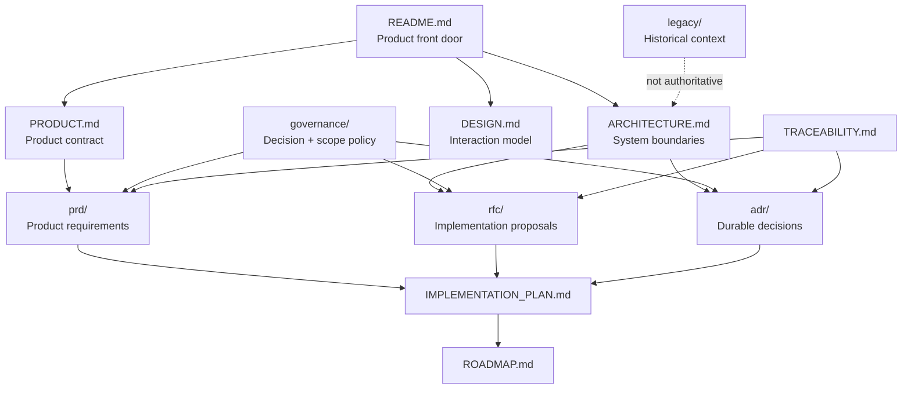
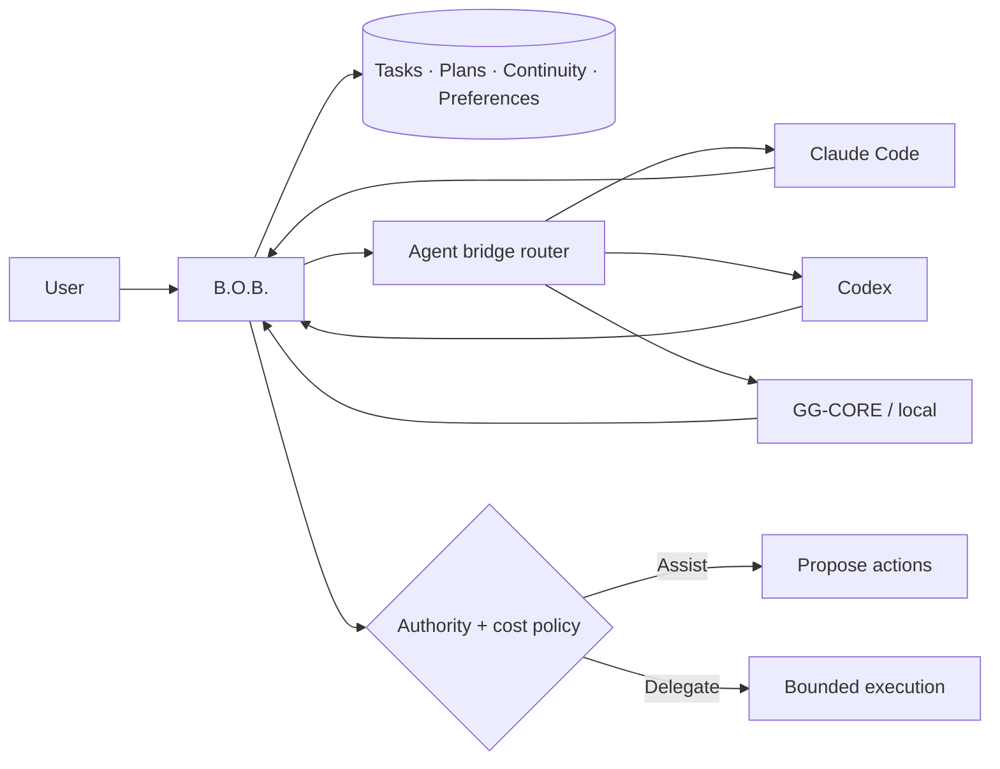

# B.O.B. Documentation

This directory is the authoritative design and decision surface for the Better Organized Brain revival.

The root [`README.md`](../README.md) is the product front door. This index answers the next question: **where is the governing detail for the thing I am about to change?**

## Documentation topology

## Start by intent

| You need to… | Read |
| --- | --- |
| Understand why B.O.B. exists and what it owns | [`PRODUCT.md`](PRODUCT.md) |
| Understand components, state ownership, agent bridges, trust boundaries, and data flow | [`ARCHITECTURE.md`](ARCHITECTURE.md) |
| Understand Today, Inbox, Chat, accessibility, overwhelm reduction, and interaction rules | [`DESIGN.md`](DESIGN.md) |
| Understand implementation order and acceptance gates | [`IMPLEMENTATION_PLAN.md`](IMPLEMENTATION_PLAN.md) |
| Understand release sequencing | [`ROADMAP.md`](ROADMAP.md) |
| Trace requirements to decisions and planned implementation | [`TRACEABILITY.md`](TRACEABILITY.md) |
| Propose or review user-facing requirements | [`prd/`](prd/) |
| Propose or review a significant implementation mechanism | [`rfc/`](rfc/) |
| Propose or review a durable architectural choice | [`adr/`](adr/) |
| Understand decision authority, scope, documentation, and AI-cost policy | [`governance/`](governance/) |
| Understand what was retired from the original prototype | [`legacy/`](legacy/) |
| Review active revival history | [`CHANGELOG.md`](CHANGELOG.md) |

## Authority order

When documents appear to disagree, do not guess. Resolve the conflict using this order:

1. explicit repository-owner direction recorded in the current governing change;
2. accepted ADRs and PRDs;
3. accepted RFCs;
4. current product and architecture documents;
5. implementation plans and roadmap;
6. historical material.

A `Proposed` record is a proposal, not a loophole for implementation to choose its favorite answer. Resolve material uncertainty before building on it.

## Product contract at a glance

The invariant is simple: **B.O.B. owns durable personal work state. Agent systems provide intelligence and explicitly bounded execution.**

## Documentation quality bar

Documentation must be:

- **truthful:** describe what exists, distinguish target from implemented state, and avoid aspirational capability claims;
- **bounded:** state ownership, authority, cost, failure modes, and non-goals explicitly;
- **traceable:** material behavior should lead back to a PRD, RFC, ADR, or a documented reason why one is unnecessary;
- **visual when structure matters:** architecture, state transitions, routing, authority, and user flows should use Mermaid or concise ASCII diagrams when a diagram communicates better than paragraphs;
- **navigable:** a reader should know where to go next without searching the entire repository;
- **maintained with code:** stale documentation is a defect, not harmless prose.

Detailed requirements are in [`governance/DOCUMENTATION_STANDARD.md`](governance/DOCUMENTATION_STANDARD.md).

## Current implementation status

The revival line is presently **design-complete enough to begin the foundation implementation, but not yet a runnable replacement application**. The active tree intentionally excludes the retired Electron/Ollama implementation so old code cannot masquerade as the current product.

The next implementation boundary is defined in [`IMPLEMENTATION_PLAN.md`](IMPLEMENTATION_PLAN.md): establish the Tauri/Rust foundation and canonical local-state boundary before agent integrations.

## Historical material

Do not copy architecture from old source paths because they look more concrete than the design documents. The original prototype included useful ideas alongside abandoned experiments, duplicate runtimes, an AI HTTP server, Ollama assumptions, RAG infrastructure, checked-in model artifacts, and cognitive-profile concepts that are not part of the revived product contract.

See [`legacy/README.md`](legacy/README.md) for preservation and retrieval details.
