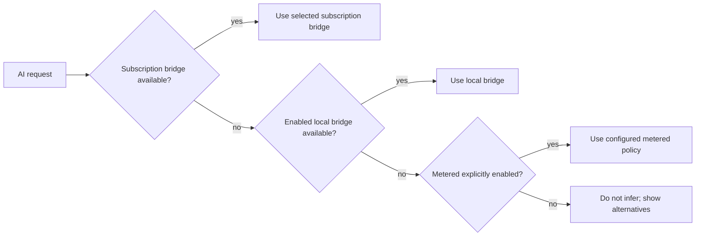

# AI Cost and Provider Policy

## Objective

Make B.O.B. safe for sustained personal use without surprise usage charges or hidden provider changes.

## Billing classes

Every agent bridge must expose a billing class before invocation:

| Class | Meaning | Default policy |
| --- | --- | --- |
| `subscription` | Invocation is expected to consume an included vendor subscription allowance rather than direct per-token API billing | Allowed when configured |
| `local` | Inference runs on user-controlled local compute without vendor inference fees | Allowed when configured |
| `metered` | Invocation may generate separately billed usage | Disabled by default |
| `unknown` | Billing behavior cannot be classified with confidence | Blocked |

OAuth, API keys, CLI login, and browser login are authentication mechanisms. They do not determine billing class by themselves.

## Default ordering

The user may choose a specific allowed bridge rather than following this preference order.

## No silent fallback

A bridge failure, authentication failure, rate limit, subscription allowance exhaustion, or provider outage must not silently cause metered API traffic.

Valid outcomes include:

- use another enabled subscription bridge;
- use an enabled local bridge;
- wait for allowance/reset;
- continue without AI;
- explicitly enable a metered provider.

## Metered enablement

Metered inference requires an explicit settings action. The UI must identify that the provider is metered. Later implementations may add budget ceilings, but absence of a budget feature does not weaken the default-disabled rule.

## Provider verification

Bridge documentation must identify the supported vendor surface being used and the basis for its billing classification. When vendor terms or product behavior change, the classification must be re-verified before documentation continues to claim subscription-backed use.

## Terms and support boundaries

B.O.B. should integrate supported programmatic or CLI interfaces. Do not rely on reverse-engineered private app protocols, credential scraping, or mechanisms intended to bypass vendor billing or usage controls.

## Local inference

Local inference is considered no-vendor-inference-fee, not zero-cost. Compute, power, hardware, and setup costs still exist. The UI need not monetize those costs but should describe them accurately.

## Logging

Do not log secrets, raw authentication tokens, or unnecessary billing metadata. Operational status should use non-sensitive bridge identifiers and normalized error classes.
