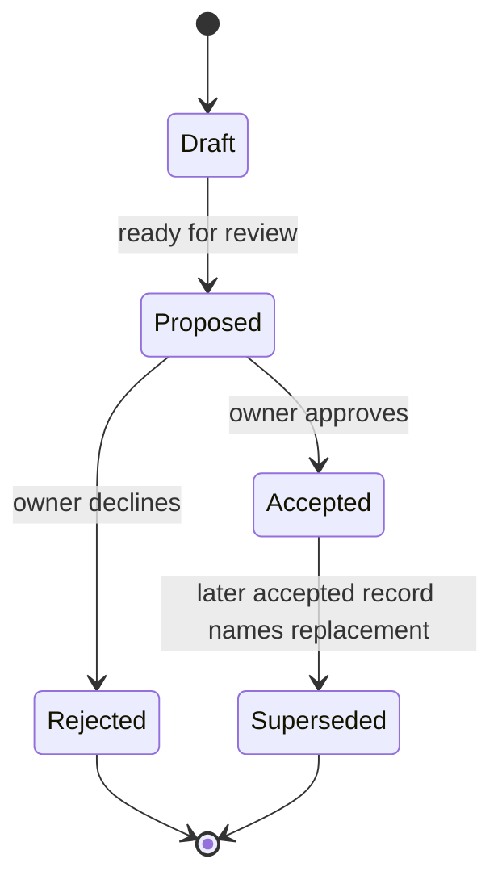

# Decision Process

## Objective

Create enough durable record that a future contributor can understand why the product and architecture look the way they do without reconstructing intent from commit archaeology.

## Record types

### PRD

Use a PRD for user-facing capability, product behavior, scope, acceptance criteria, and meaningful non-goals.

### RFC

Use an RFC for a proposed implementation mechanism, protocol, integration strategy, storage design, or cross-cutting technical contract.

### ADR

Use an ADR for a durable architecture decision whose consequences should remain visible after the implementation discussion is over.

## Lifecycle

## Acceptance

A record is Accepted only when the repository owner approves the pull request containing the decision or explicitly updates its status through a reviewed repository change.

Merging unrelated code does not implicitly accept an unreviewed design record.

## Supersession

Do not rewrite historical decisions to hide architectural change. Create a new record and add:

- `Supersedes: ADR/RFC/PRD-XXXX`
- reason for change;
- migration consequence;
- status update to the old record.

## Traceability

Material implementation PRs should identify the records they implement. Decision-bearing PRs should identify implementation that depends on them when known.

## Emergency fixes

A security or data-integrity fix may precede a full decision record when delay would materially increase risk. The follow-up record should be added in the same PR when practical or immediately after, and must document why normal sequencing was bypassed.

## Decision quality questions

Before accepting a material record, verify:

1. Does it solve a real B.O.B. user problem?
2. Is it the smallest sufficient solution?
3. Does it preserve B.O.B. ownership of canonical state?
4. Does it change agent authority?
5. Does it create or increase metered cost?
6. Does it create vendor lock-in?
7. Does it increase information or navigation burden?
8. Can the requirement be tested or observed?
9. Are non-goals clear enough to prevent adjacent scope creep?
