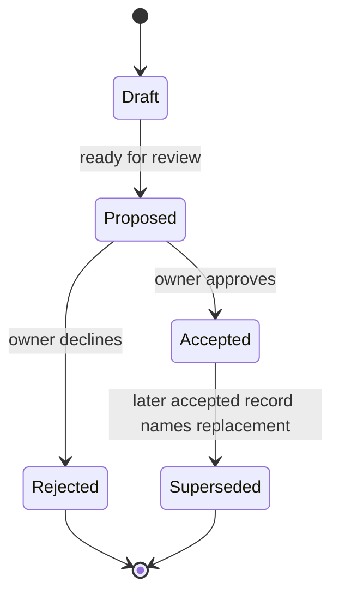

# Decision Process

## Objective

Create enough durable record that a future contributor can understand why the product and architecture look the way they do without reconstructing intent from commit archaeology.

## Record types

### PRD

Use a PRD for user-facing capability, product behavior, scope, acceptance criteria, and meaningful non-goals.

### RFC

Use an RFC for a proposed implementation mechanism, protocol, integration strategy, storage design, or cross-cutting technical contract.

### ADR

Use an ADR for a durable architecture decision whose consequences should remain visible after the implementation discussion is over.

### Wayfinder

Use [`WAYFINDER.md`](WAYFINDER.md) when a bounded product destination still contains multiple unresolved product, architecture, UX, provider, persistence, authority, or validation decisions that must converge before implementation begins.

Wayfinder does not replace PRDs, RFCs, or ADRs. It resolves the decision route first, then requires the final route to be reconciled into the durable record types above before implementation handoff.

## Lifecycle

## Acceptance

A record is Accepted only when the repository owner approves the pull request containing the decision or explicitly updates its status through a reviewed repository change.

Merging unrelated code does not implicitly accept an unreviewed design record.

During an active Wayfinder map, explicit owner dispositions in resolved Wayfinder tickets may settle destination-specific decisions before the corresponding durable record is reconciled. Those ticket resolutions govern the active map destination, but the convergence audit must not pass until required PRD/RFC/ADR and binding-document state is consistent with them.

## Supersession

Do not rewrite historical decisions to hide architectural change. Create a new record and add:

- `Supersedes: ADR/RFC/PRD-XXXX`
- reason for change;
- migration consequence;
- status update to the old record.

If a Wayfinder resolution changes a previously accepted long-term decision rather than merely narrowing a destination, treat that as real supersession and use the normal record lifecycle above.

## Traceability

Material implementation PRs should identify the records they implement. Decision-bearing PRs should identify implementation that depends on them when known.

When Wayfinder is used, implementation tickets and PRs should also point to the canonical map or the specific resolved decision ticket when that context is needed to explain the implementation boundary.

## Wayfinder convergence gate

A Wayfinder route is not implementation-ready merely because all obvious questions have comments on them.

Before implementation slicing begins, run the convergence audit defined in [`WAYFINDER.md`](WAYFINDER.md). At minimum, verify that:

- no unresolved in-scope decision or fog remains;
- no binding document contradicts the route;
- required PRD/RFC/ADR lifecycle state is unambiguous;
- obsolete or superseded decision tickets are reconciled;
- no coding agent would need to invent product, architecture, authority, provider/cost, persistence, or validation behavior.

Only then synthesize the build-ready specification and tracer-bullet implementation tickets.

## Emergency fixes

A security or data-integrity fix may precede a full decision record when delay would materially increase risk. The follow-up record should be added in the same PR when practical or immediately after, and must document why normal sequencing was bypassed.

## Decision quality questions

Before accepting a material record, verify:

1. Does it solve a real B.O.B. user problem?
2. Is it the smallest sufficient solution?
3. Does it preserve B.O.B. ownership of canonical state?
4. Does it change agent authority?
5. Does it create or increase metered cost?
6. Does it create vendor lock-in?
7. Does it increase information or navigation burden?
8. Can the requirement be tested or observed?
9. Are non-goals clear enough to prevent adjacent scope creep?
