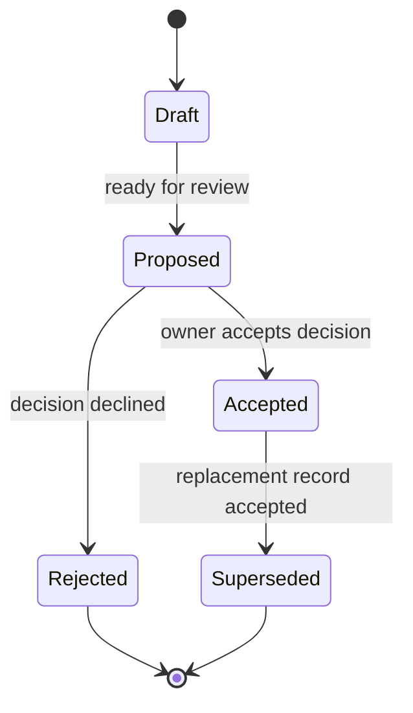

# B.O.B. Governance

## Purpose

Governance exists to keep B.O.B. coherent, reviewable, inexpensive to operate, and small enough to remain useful. It is a guardrail against architectural drift, not an excuse to manufacture ceremony.

## Authority

The repository owner is the final product and technical authority unless authority is explicitly delegated.

Material changes are reviewed through pull requests. Product intent, implementation proposals, and durable architecture decisions are recorded separately so that code cannot quietly redefine the product after the fact.

## Decision records

| Record | Answers | Use when |
| --- | --- | --- |
| **PRD** | What user problem and behavior does B.O.B. own? | User-visible capability or material product behavior changes |
| **RFC** | How should a significant mechanism, protocol, integration, or migration work? | More than one meaningful implementation path exists or a cross-boundary contract is introduced |
| **ADR** | Which durable architectural decision governs future work? | A choice should constrain later implementation |

Routine bug fixes, tests, copy corrections, and maintenance can proceed through a normal PR when they do not change a governing contract.

## Record lifecycle

A merged document is not automatically evidence that every unresolved design choice inside it has been accepted. Status fields remain authoritative. Implementation that depends on a `Proposed` decision must resolve that decision first.

## Governing product boundary

B.O.B. is a personal AI workbench with ADHD-friendly interaction design. Scope stays anchored to:

- personal task and planning continuity;
- low-friction capture and organization;
- one durable work state across multiple supported agents;
- explicit agent authority;
- subscription-first inference cost control;
- local-first canonical state;
- accessible, low-cognitive-load interaction.

A proposed feature outside those boundaries must explain why B.O.B. should own it rather than an existing vendor agent, operating system, calendar, task manager, or separate project.

## Review questions

A material change should make these answers obvious:

1. What user problem does this solve?
2. Which requirement or decision authorizes it?
3. Does it add a new top-level surface or duplicate an existing one?
4. What new authority, filesystem access, data access, or credential access does it introduce?
5. Does it change canonical-state ownership or migration behavior?
6. Does it change inference provider, cost class, or fallback behavior?
7. Could it increase cognitive load or weaken accessibility?
8. How is success and failure validated?
9. Which documentation becomes true or false because of this change?
10. What can be deleted because this change exists?

## Hard rules

### B.O.B. owns canonical work

Agents may reason, generate, and perform explicitly delegated work, but vendor sessions do not become the canonical home for tasks, plans, preferences, or continuity.

### No silent metered fallback

B.O.B. must never silently switch from subscription-backed or local inference to a metered API. Metered use requires explicit enablement and visible cost-policy state. Unknown billing classification fails closed.

### Authority is mode-dependent

Assist mode proposes. Delegate mode acts only within an explicit bounded grant. A chat request does not inherit coding-agent permissions merely because the same underlying vendor can execute tools.

### Documentation is part of correctness

A capability is not complete when its architecture, state ownership, authority, cost behavior, or user-visible behavior is materially undocumented. Documentation changes ship with the change that makes them true.

### The active tree represents the active product

Git history and named archive branches preserve retired work. `master` must not accumulate obsolete implementations, generated inventories, downloaded models, or duplicate experiments for sentimental reasons.

## Detailed policies

- [`DECISION_PROCESS.md`](DECISION_PROCESS.md)
- [`SCOPE_GUARDRAILS.md`](SCOPE_GUARDRAILS.md)
- [`AI_COST_AND_PROVIDER_POLICY.md`](AI_COST_AND_PROVIDER_POLICY.md)
- [`DOCUMENTATION_STANDARD.md`](DOCUMENTATION_STANDARD.md)

Repository-level coding-agent requirements are in [`../../AGENTS.md`](../../AGENTS.md).
