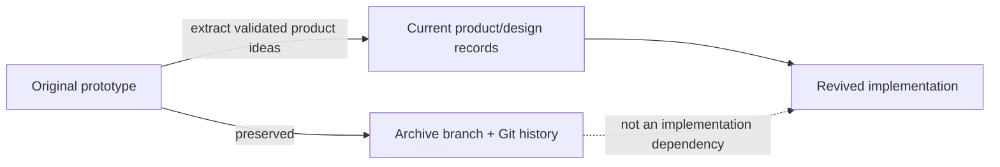

# Legacy Archive

This directory documents the original B.O.B. prototype without keeping that implementation in the active product tree.

## Preservation point

The complete repository state immediately before the revival cleanup is preserved on:

`archive/pre-revival-cleanup-2026-08-19`

Archive head at creation:

`c1fedacb946c542afc1889ec156c16575f4f11a0`

Git history also retains every removed path.

## What the archive contains

The historical tree includes the original Electron application, Ollama-oriented AI server, local HTTP process management, RAG/vector experiments, document ingestion, Python skeletons, module-system experiments, adaptive-behavior work, historical version snapshots, npm manifests and lockfiles, model-download scripts, generated repository inventories, UI assets, and a checked-in embedding model.

Some product ideas remain valuable. The implementation architecture is not authoritative.

## Why it was removed from `master`

The active root had accumulated multiple generations of experiments side by side. That made it impossible to distinguish current architecture from abandoned paths, kept a large obsolete dependency graph alive, caused irrelevant Dependabot traffic, and left heavyweight generated/model artifacts in the primary development surface.

The revival deliberately starts from the product contract instead of incrementally polishing the old runtime.

## Rules for using legacy material

1. Historical code may be inspected for product ideas, behavior, or provenance.
2. It must not be copied forward merely because it already exists.
3. A legacy component only returns to active development when a current PRD/RFC/ADR justifies it.
4. Old dependency or security fixes should not be merged into `master` when the affected dependency is not part of the revived architecture.
5. Historical model artifacts should remain out of the active tree unless a future reviewed distribution decision explicitly requires them.

## Historical changelog

[`ALPHA_CHANGELOG.md`](ALPHA_CHANGELOG.md) preserves the original alpha-era changelog as written.

## Support status

The archive branch is not supported, released, patched, or monitored as a product line. It exists for provenance and recovery only.
