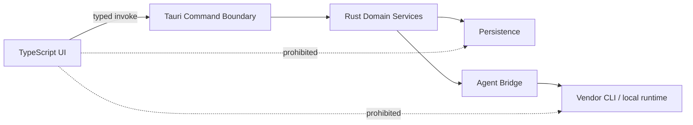

# RFC-0001: Tauri + Rust Revival Architecture

**Status:** Proposed  
**Related:** ADR-0002, RFC-0003

## Proposal

Replace the legacy Electron application architecture with a Tauri 2 desktop shell, Rust application core, and lightweight TypeScript frontend.

## Motivation

The old application couples renderer code to privileged Node access and carries an Electron, local-server, Ollama/RAG, and duplicated-runtime footprint that is disproportionate to B.O.B.'s target scope.

The revived product needs:

- a desktop window;
- strong native boundary;
- local persistence;
- controlled process invocation for supported agent CLIs;
- optional direct Rust integration with GG-CORE later;
- a productive HTML/CSS-based interface.

Tauri provides that shape without requiring B.O.B. to ship a full Node/Electron application runtime.

## Proposed component structure

```text
src-tauri/
  src/
    commands/
    domain/
      items/
      planner/
      continuity/
    agents/
      bridge.rs
      claude_code.rs
      codex.rs
      gg_core.rs        # optional later
    policy/
    persistence/
    security/

src/
  app/
  components/
  surfaces/
    today/
    inbox/
    chat/
    settings/
  state/
  styles/
```

This is directional, not a requirement to create empty directories before code needs them.

## Frontend choice

Use TypeScript with the smallest practical component approach. Start with vanilla components or a minimal framework only if state complexity justifies it. React is not a default requirement.

## Native boundary

The frontend communicates through narrow typed Tauri commands/events. It must not receive generic shell execution or arbitrary filesystem APIs.



## Process execution

The Rust core may invoke supported vendor CLIs through bridge-specific adapters. Invocation must use explicit executable/configuration, bounded arguments, controlled working directories, and captured structured output.

Do not expose a general-purpose `run command` capability to the UI.

## GG-CORE compatibility

Rust makes a future in-process GG-CORE bridge possible. B.O.B. must not depend on GG-CORE for its first revived releases.

## Rejected alternatives

### Continue Electron

Possible, but requires substantial security modernization while preserving a heavier runtime and offers no special advantage for the target architecture.

### Native Rust UI

Reduces WebView reliance but would spend project effort rebuilding interaction patterns that HTML/CSS handle efficiently.

### Go/Wails

Viable lightweight desktop alternative, but introduces a second native language ecosystem while weakening the clean future path to Rust-native GG-CORE integration.

### Browser-only web application

Simplifies distribution but complicates secure local CLI/process integration and local-first desktop behavior.

## Migration strategy

Do not perform an in-place conversion of legacy files. Establish the new shell and vertical slice, port required behavior intentionally, then remove superseded legacy implementation from the active tree after preserving a legacy tag.

## Acceptance criteria

- application packages as a Tauri desktop application on the primary supported platform;
- frontend has no unrestricted process/filesystem/credential access;
- domain logic can be tested without rendering the UI;
- persistence and agent bridges live behind Rust interfaces;
- application can launch and manage tasks with no agent configured;
- no local HTTP server is required for core operation.
