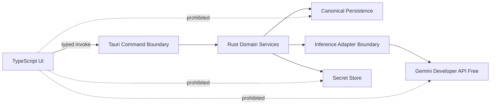

# RFC-0001: Tauri + Rust Revival Architecture

**Status:** Accepted  
**Related:** ADR-0002, RFC-0003, Wayfinder map `first runnable B.O.B. alpha`

## Proposal

Replace the legacy Electron application architecture with a Tauri 2 desktop shell, Rust application core, and framework-free TypeScript + Vite frontend for the first alpha.

## Motivation

The old application couples renderer code to privileged Node access and carries an Electron, local-server, Ollama/RAG, and duplicated-runtime footprint that is disproportionate to B.O.B.'s target scope.

The revived product needs:

- a desktop window;
- strong native security boundary;
- local persistence and recovery;
- protected credential access;
- a narrow inference/network adapter boundary;
- straightforward Windows packaging;
- a productive HTML/CSS-based interface.

Tauri provides that shape without requiring B.O.B. to ship a full Node/Electron application runtime.

The first alpha does not depend on vendor CLI execution or local inference. Those remain future-compatible adapter seams.

## Initial component structure

```text
src-tauri/
  src/
    commands/
    domain/
      items/
      planner/
      continuity/
    inference/
      adapter.rs
      gemini.rs
    policy/
    persistence/
    security/

src/
  app/
  components/
  surfaces/
    today/
    inbox/
    chat/
    settings/
  state/
  styles/
```

This is directional, not a requirement to create empty directories before code needs them.

## Frontend choice

Use TypeScript + Vite with lightweight framework-free modules/components for the first alpha. React or another framework is not prohibited, but adoption requires demonstrated state/rendering complexity that creates a concrete maintenance problem.

## Primary platform

Windows 11 x64 is the first supported alpha platform and the acceptance target for packaging and native credential behavior.

Preserve reasonable architectural compatibility with macOS/Linux, but do not turn cross-platform certification into a first-alpha blocker.

## Native boundary

The frontend communicates through narrow typed Tauri commands/events. It must not receive generic shell execution, arbitrary filesystem APIs, direct database access, or credential access.



## Inference and future runtime seams

The first-alpha inference path is Gemini Developer API Free through a Rust-owned adapter boundary.

Future supported vendor CLIs, account-backed runtimes, and local inference may use additional adapters without changing B.O.B.'s user-facing identity or canonical state ownership. Do not expose a general-purpose `run command` capability to the UI.

## Local inference compatibility

Rust keeps future in-process or constrained-IPC local inference possible, including a potential GG-CORE adapter. B.O.B. does not depend on GG-CORE or any local inference runtime for the first alpha.

## Rejected alternatives

### Continue Electron

Possible, but requires substantial security modernization while preserving a heavier runtime and offers no special advantage for the target architecture.

### Native Rust UI

Reduces WebView reliance but would spend project effort rebuilding interaction patterns that HTML/CSS handle efficiently.

### Go/Wails

Viable lightweight desktop alternative, but introduces another native ecosystem without a current product requirement.

### Browser-only web application

Simplifies distribution but weakens the local-first native secret, recovery, and desktop packaging model.

### React by default

No current alpha interaction complexity requires it. Adding a framework before that complexity exists would increase implementation surface without solving a demonstrated problem.

## Migration strategy

Do not perform an in-place conversion of legacy files. Establish the new shell and vertical slices from the build-ready Wayfinder specification, port required behavior intentionally, then remove superseded legacy implementation from the active tree after preserving history in Git.

## Acceptance criteria

- application packages as a Tauri desktop application for Windows 11 x64;
- frontend has no unrestricted process/filesystem/credential/database access;
- domain logic can be tested without rendering the UI;
- persistence, secret storage, and inference live behind Rust interfaces;
- application can launch and manage deterministic planning behavior with no inference available;
- Gemini is accessed through the approved adapter boundary when configured;
- no local HTTP inference server is required for core operation;
- framework adoption is not required unless later justified by measured complexity.

## Wayfinder disposition

Accepted by owner disposition in `Wayfinder: grilling | Confirm desktop foundation and frontend strategy`, with amendments aligning the rationale to the Gemini-first, local-inference-deferred alpha route.
