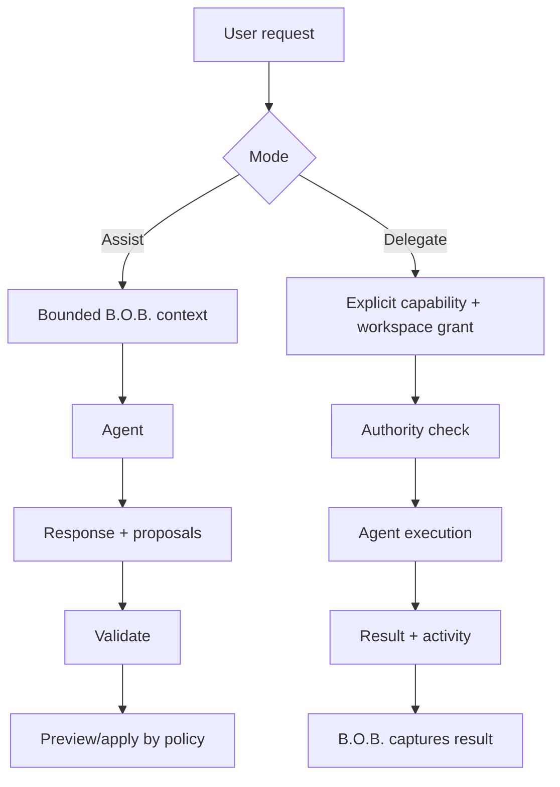

# RFC-0002: Agent Bridge Protocol

**Status:** Proposed  
**Related:** PRD-0001, PRD-0003, ADR-0001, ADR-0003, ADR-0005

## Proposal

Create a small internal `AgentBridge` contract that normalizes supported agent surfaces without pretending their capabilities are identical.

## Conceptual interface

```rust
trait AgentBridge {
    fn id(&self) -> AgentId;
    fn capabilities(&self) -> AgentCapabilities;
    fn billing_class(&self) -> BillingClass;
    async fn status(&self) -> AgentStatus;
    async fn execute(&self, request: AgentRequest) -> Result<AgentResult, AgentError>;
    async fn cancel(&self, operation: OperationId) -> Result<(), AgentError>;
}
```

The exact Rust types may change during implementation. The semantic contract is normative.

## AgentCapabilities

Capabilities are explicit rather than inferred from vendor name. Candidate flags include:

- conversational reasoning;
- structured output;
- coding;
- filesystem workspace execution;
- shell/tool execution;
- streaming;
- cancellation;
- session continuation.

Unsupported capabilities must fail clearly.

## AgentRequest

A request includes:

- operation ID;
- mode: Assist or Delegate;
- user instruction;
- bounded context package;
- requested structured-output schema when relevant;
- allowed capabilities;
- optional bounded workspace;
- timeout/cancellation metadata;
- cost policy snapshot.

## AgentResult

A result includes:

- operation ID;
- provider/bridge ID;
- human-readable response;
- structured proposed actions when present;
- execution metadata safe for user inspection;
- terminal status;
- error classification when unsuccessful.

## Proposed B.O.B. actions

Agent output must never be treated as executable application code. Supported proposals use an allowlisted schema, for example:

```json
{
  "type": "schedule_task",
  "taskId": "task-42",
  "start": "2026-08-19T10:30:00-04:00"
}
```

The core verifies identity, schema, current state, scheduling constraints, and required confirmation before applying the proposal.

## Assist versus Delegate



Assist mode must not silently request Delegate capabilities.

## Bridge-specific adapters

### Claude Code

Use a documented machine-consumable non-interactive invocation path and vendor-owned subscription authentication. Restrict working directory and tool authority for ordinary Assist requests.

### Codex

Use a supported programmatic/CLI surface compatible with ChatGPT subscription authentication. Restrict capabilities according to B.O.B. mode and policy.

### GG-CORE

Treat local inference as another bridge. It provides model execution, not business authority. B.O.B. continues to own tool/action semantics.

## Error model

Normalize at least:

- unavailable;
- unauthenticated;
- allowance exhausted;
- policy blocked;
- timeout;
- cancelled;
- invalid response;
- unsupported capability;
- execution failure.

Do not collapse all failures into `agent failed` if B.O.B. can provide an actionable distinction.

## Security requirements

- sanitize logs;
- no raw credentials in request structs that reach the UI;
- no arbitrary shell command supplied by agent output;
- enforce bounded working directory in Delegate mode;
- validate structured proposals before state mutation;
- fail closed for unknown billing class.

## Acceptance criteria

Two different subscription-backed bridge implementations can satisfy the interface while preserving their distinct capabilities, cost class, errors, and authorization boundaries.
