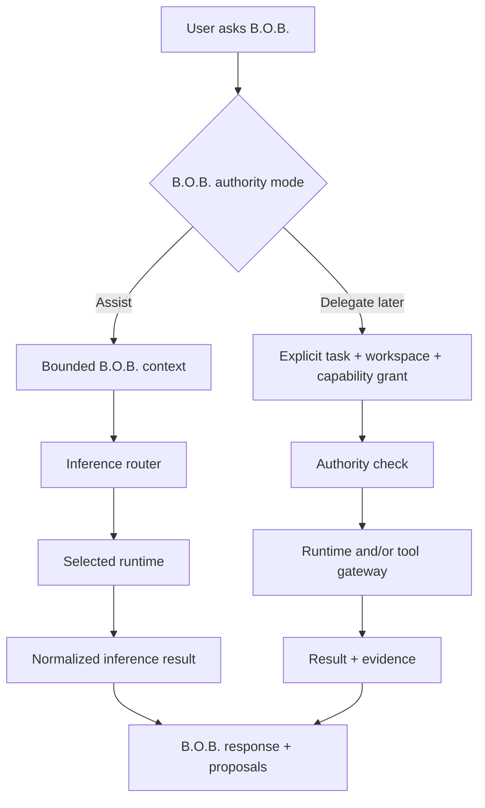

# RFC-0002: Runtime Adapter Protocol

**Status:** Accepted  
**Related:** PRD-0001, PRD-0003, ADR-0001, ADR-0005  
**Historical context:** ADR-0003 was rejected after the first-alpha inference route changed.

## Proposal

Create a small internal `RuntimeAdapter` contract that lets the single B.O.B. agent use different LLM/inference backends over time without changing canonical product state or user-facing identity.

Execution tools are exposed through a separate bounded tool gateway. A runtime may advertise tool-capable execution, but that capability is still subject to B.O.B.'s authority policy.

## First-alpha applicability

This RFC remains the accepted long-term architectural seam for multiple inference/runtime capabilities, but its original multi-adapter rollout assumptions are **not** first-alpha requirements.

Resolved Wayfinder decisions for the first runnable alpha establish that:

- B.O.B. has one required inference path: **Gemini Developer API Free**;
- a second backend is deferred;
- local inference is deferred;
- Delegate/tool execution is deferred;
- B.O.B. remains useful in deterministic mode when inference is unavailable;
- no paid or different backend may be selected silently.

Accordingly, the Claude, Codex, GG-CORE, multi-backend selection, Delegate, and two-adapter acceptance material below describes future expansion capability rather than implementation authority for the first alpha.

The exact narrow first-alpha agent-core and Gemini adapter contract remains intentionally unresolved until the active Wayfinder decision `Wayfinder: grilling | Define B.O.B. agent core and runtime-routing contract` is accepted or amended. This RFC must not be used to answer that owner decision by implication.

## Product invariant

> **The adapter selects capability, not identity. The user is always interacting with B.O.B.**

## Conceptual interface

```rust
trait RuntimeAdapter {
    fn id(&self) -> RuntimeId;
    fn capabilities(&self) -> RuntimeCapabilities;
    fn billing_class(&self) -> BillingClass;
    async fn status(&self) -> RuntimeStatus;
    async fn execute(&self, request: InferenceRequest) -> Result<InferenceResult, RuntimeError>;
    async fn cancel(&self, operation: OperationId) -> Result<(), RuntimeError>;
}
```

The exact Rust types may change during implementation. The semantic contract is normative for the future multi-adapter architecture. First-alpha code should implement only the subset authorized by the resolved Wayfinder route.

## Runtime capabilities

Capabilities are explicit rather than inferred from vendor name. Candidate flags for future adapters include:

- conversational reasoning;
- structured output;
- coding;
- streaming;
- cancellation;
- session continuation;
- workspace-aware execution;
- shell/tool execution where the underlying runtime supports it and B.O.B. authority policy permits it.

Unsupported capabilities fail clearly. Capability flags that have no authorized first-alpha consumer should not be implemented merely because they appear here.

## InferenceRequest

The long-term request shape may include:

- operation ID;
- B.O.B. authority mode: Assist or, in a later release, Delegate;
- user instruction;
- bounded B.O.B. context package;
- requested structured-output schema when relevant;
- required runtime capabilities when multiple capabilities actually exist;
- optional bounded workspace for later Delegate mode;
- timeout/cancellation metadata;
- cost-policy snapshot;
- privacy/runtime constraints.

For the first alpha, Delegate-specific fields and generalized multi-backend capability negotiation are deferred unless a later resolved Wayfinder decision explicitly brings them back into scope.

## InferenceResult

A result includes:

- operation ID;
- runtime/provider ID;
- model identity where available and useful;
- model/runtime output;
- structured proposed B.O.B. actions when present;
- execution metadata safe for inspection;
- terminal status;
- error classification when unsuccessful.

The result does not become a separate agent conversation. B.O.B. integrates it into B.O.B.'s own response and continuity.

## Proposed B.O.B. actions

Model output must never be treated as executable application code. Supported proposals use an allowlisted schema, for example:

```json
{
  "type": "schedule_task",
  "taskId": "task-42",
  "start": "2026-08-19T10:30:00-04:00"
}
```

The core verifies schema, current state, scheduling constraints, authority, and required confirmation before applying a proposal.

## Assist versus Delegate



Assist mode must not silently request Delegate capabilities. Delegate execution is not a first-alpha requirement.

## Runtime expansion paths

### First alpha

Gemini Developer API Free is the sole required inference path. The exact first-alpha adapter surface is owned by the active Wayfinder agent-core/runtime-routing decision, not by the older multi-adapter examples in this RFC.

### Claude runtime adapter

A later release may use a supported machine-consumable invocation path and vendor-owned authentication where appropriate. Restrict working directory and execution authority for ordinary Assist requests.

### Codex runtime adapter

A later release may use a supported programmatic/CLI surface. Normalize its available capabilities while preserving B.O.B. as the user-facing identity.

### GG-CORE runtime adapter

A later release may treat GG-CORE as a local inference capability. It provides model execution, not B.O.B. business authority or canonical state ownership.

None of these later adapters is an alpha blocker.

## Tool gateway

Tool execution is not represented as another agent. B.O.B. may eventually invoke allowlisted tools through a separate gateway under explicit authority policy.

A runtime capable of invoking tools directly must still be constrained to the permissions B.O.B. granted for the operation. Unsupported restriction capabilities must be surfaced rather than ignored.

Tool/Delegate execution remains deferred for the first runnable alpha.

## Error model

Normalize at least:

- unavailable;
- unauthenticated;
- allowance exhausted;
- policy blocked;
- timeout;
- cancelled;
- invalid response;
- unsupported capability;
- execution failure.

Do not collapse all failures into `runtime failed` when B.O.B. can provide an actionable distinction.

The active Wayfinder agent-core/runtime decision owns the exact minimum error set required for the first alpha.

## Security requirements

- sanitize logs;
- no raw credentials in request structs that reach the UI;
- no arbitrary shell command supplied by model output;
- enforce bounded working directory if Delegate mode is introduced later;
- validate structured proposals before state mutation;
- fail closed for unknown billing class;
- preserve B.O.B. as the only canonical conversation identity.

## Acceptance criteria

### Durable multi-adapter architecture

When a later release actually introduces multiple backends, two materially different runtime adapters should be able to satisfy the shared interface while preserving their distinct capabilities, cost class, errors, and authorization boundaries, with the user experiencing both through the same B.O.B. identity and canonical state.

### First runnable alpha

This RFC does not require two adapters, subscription-backed inference, local inference, or Delegate/tool execution for alpha acceptance. First-alpha acceptance follows the resolved Wayfinder destination and the eventual accepted resolution of the active agent-core/runtime-routing ticket.
