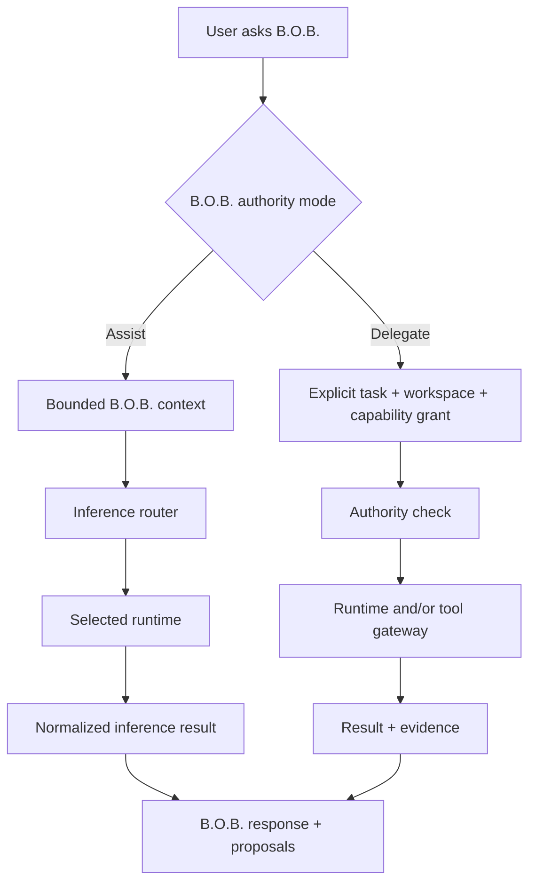

# RFC-0002: Runtime Adapter Protocol

**Status:** Accepted  
**Related:** PRD-0001, PRD-0003, ADR-0001, ADR-0003, ADR-0005

## Proposal

Create a small internal `RuntimeAdapter` contract that lets the single B.O.B. agent use different LLM/inference backends without changing canonical product state or user-facing identity.

Execution tools are exposed through a separate bounded tool gateway. A runtime may advertise tool-capable execution, but that capability is still subject to B.O.B.'s authority policy.

## Product invariant

> **The adapter selects capability, not identity. The user is always interacting with B.O.B.**

## Conceptual interface

```rust
trait RuntimeAdapter {
    fn id(&self) -> RuntimeId;
    fn capabilities(&self) -> RuntimeCapabilities;
    fn billing_class(&self) -> BillingClass;
    async fn status(&self) -> RuntimeStatus;
    async fn execute(&self, request: InferenceRequest) -> Result<InferenceResult, RuntimeError>;
    async fn cancel(&self, operation: OperationId) -> Result<(), RuntimeError>;
}
```

The exact Rust types may change during implementation. The semantic contract is normative.

## Runtime capabilities

Capabilities are explicit rather than inferred from vendor name. Candidate flags include:

- conversational reasoning;
- structured output;
- coding;
- streaming;
- cancellation;
- session continuation;
- workspace-aware execution;
- shell/tool execution where the underlying runtime supports it.

Unsupported capabilities fail clearly.

## InferenceRequest

A request includes:

- operation ID;
- B.O.B. authority mode: Assist or Delegate;
- user instruction;
- bounded B.O.B. context package;
- requested structured-output schema when relevant;
- required runtime capabilities;
- optional bounded workspace for Delegate mode;
- timeout/cancellation metadata;
- cost-policy snapshot;
- privacy/runtime constraints.

## InferenceResult

A result includes:

- operation ID;
- runtime/provider ID;
- model identity where available and useful;
- model/runtime output;
- structured proposed B.O.B. actions when present;
- execution metadata safe for inspection;
- terminal status;
- error classification when unsuccessful.

The result does not become a separate agent conversation. B.O.B. integrates it into B.O.B.'s own response and continuity.

## Proposed B.O.B. actions

Model output must never be treated as executable application code. Supported proposals use an allowlisted schema, for example:

```json
{
  "type": "schedule_task",
  "taskId": "task-42",
  "start": "2026-08-19T10:30:00-04:00"
}
```

The core verifies schema, current state, scheduling constraints, authority, and required confirmation before applying a proposal.

## Assist versus Delegate



Assist mode must not silently request Delegate capabilities.

## Initial adapters

### Claude runtime adapter

Use a supported machine-consumable invocation path and vendor-owned authentication where appropriate. Restrict working directory and execution authority for ordinary Assist requests.

### Codex runtime adapter

Use a supported programmatic/CLI surface. Normalize its available capabilities while preserving B.O.B. as the user-facing identity.

### GG-CORE runtime adapter

Treat GG-CORE as a local inference capability. It provides model execution, not B.O.B. business authority or canonical state ownership.

## Tool gateway

Tool execution is not represented as another agent. B.O.B. invokes allowlisted tools through a separate gateway under explicit authority policy.

A runtime capable of invoking tools directly must still be constrained to the permissions B.O.B. granted for the operation. Unsupported restriction capabilities must be surfaced rather than ignored.

## Error model

Normalize at least:

- unavailable;
- unauthenticated;
- allowance exhausted;
- policy blocked;
- timeout;
- cancelled;
- invalid response;
- unsupported capability;
- execution failure.

Do not collapse all failures into `runtime failed` when B.O.B. can provide an actionable distinction.

## Security requirements

- sanitize logs;
- no raw credentials in request structs that reach the UI;
- no arbitrary shell command supplied by model output;
- enforce bounded working directory in Delegate mode;
- validate structured proposals before state mutation;
- fail closed for unknown billing class;
- preserve B.O.B. as the only canonical conversation identity.

## Acceptance criteria

Two different subscription-backed runtime adapters can satisfy the interface while preserving their distinct capabilities, cost class, errors, and authorization boundaries, and the user experiences both through the same B.O.B. agent and canonical state.
