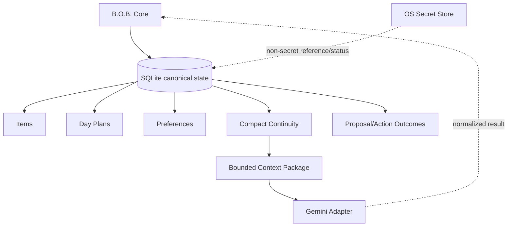

# RFC-0003: Local State and Continuity Model

**Status:** Accepted  
**Related:** ADR-0004, RFC-0001  
**Wayfinder:** #33

## Proposal

B.O.B. maintains a versioned local canonical data store owned by the Rust application core. Inference-provider sessions are integration details and are not required to reconstruct the user's tasks, day plans, preferences, or B.O.B. continuity.

For the first alpha, the canonical ordinary-state store is SQLite. This RFC defines how that accepted store participates in continuity, migration, recovery, backup, export, and secret separation.

## Design goals

- single-user desktop simplicity;
- no required cloud service;
- schema versioning from the first revived release;
- transactional logical state changes;
- safe restart behavior;
- explicit migration compatibility checks;
- recoverable schema/application failures;
- documented user backup and portable export;
- compact B.O.B.-owned continuity independent of the inference provider;
- no accidental creation of a competing advanced memory architecture.

## Data ownership

The frontend and inference adapter never open or mutate SQLite directly.

## Persistence mechanism

Use one local SQLite database in the OS-appropriate B.O.B. application-data location.

Every logical state change that spans related records commits as one SQLite transaction or not at all. Ordinary crash consistency relies on SQLite's journal/WAL mechanisms rather than a B.O.B.-specific shadow-file protocol. WAL is an implementation choice, not a product requirement; if used, backup behavior must remain SQLite-aware.

Rust owns an explicit immutable monotonic migration history. Startup checks schema compatibility before normal services become writable. An unknown newer schema fails closed into a recovery/export path rather than attempting a downgrade or destructive repair.

## Required entities

### Item

Tasks, ideas, notes, and reminders share capture identity and may carry type-specific optional fields.

### DayPlan

Owns date, focus selection, blocks, and relevant planning metadata.

### Preference

Owns UI, accessibility, planning, inference, and cost-policy settings that are not protected secrets.

### ContinuityRecord

Stores compact B.O.B.-owned summaries and work associations needed to resume intent across restart and future backend changes. It must not become an indiscriminate provider-transcript warehouse.

### ActionRecord

Stores enough information to explain material B.O.B. proposals, user disposition, and resulting state changes without retaining unnecessary model internals.

## Secret separation

Gemini and future provider credentials are not ordinary canonical data. Secret material remains in platform-appropriate protected storage. SQLite may store non-secret configured/not-configured state, references, validation status/timestamps, and other non-secret provider metadata where useful.

Portable export and ordinary backups must never expose OS secret-store payloads.

## Backup and export

Backup and portable export are distinct:

- **Backup:** a SQLite-consistent snapshot intended for full B.O.B. restoration.
- **Portable export:** a documented, versioned JSON package expressed in stable product terms rather than raw internal tables.

Portable export includes user-owned ordinary state required for inspection or meaningful restoration, including tasks/inbox items, day plans, safe preferences, and compact continuity/history. Credentials are excluded.

A generalized arbitrary-import/interchange system is not required for alpha. If portable import is later added, it must validate the export schema before changing canonical state.

## Migration and recovery

Before a schema-changing migration:

1. perform an integrity check appropriate to the migration path;
2. create a SQLite-consistent safety copy;
3. run migrations transactionally where SQLite permits;
4. reopen and verify resulting schema/version;
5. only then mark startup healthy.

Retain the current database plus two most recent pre-migration known-good safety copies.

If migration, corruption, incompatible schema, or open failure occurs:

- preserve the original/failed database;
- do not silently create an empty replacement and continue;
- keep the latest verified known-good safety copies;
- provide the smallest safe recovery choices, such as retry, explicit restore, or recover/export where possible;
- automatic restore is permitted only when policy can prove it will not discard newer recoverable user data.

Destructive reset remains an explicit user action.

## Memory-architecture boundary

The alpha SQLite schema owns ordinary B.O.B. application state only. It is not authority to design a new advanced agent-memory subsystem.

When richer governed-memory behavior becomes relevant, B.O.B. should preferentially consume/reuse the existing `MythologIQ-Labs-LLC/agent-memory` repository through a later explicit integration contract. That future work may extend how B.O.B. packages or persists governed memory, but it must preserve the accepted B.O.B. product/state boundary and must not silently replace this alpha persistence contract.

## Legacy import

Importing old prototype `localStorage` data is optional and should be implemented only if real retained user data justifies it. The revival must not inherit an awkward persistence model solely for hypothetical migration.

## Acceptance criteria

- restart preserves ordinary canonical state;
- related logical state changes are transactional;
- schema/migration version is explicit and migration history is immutable once shipped;
- migration/open failure does not silently reset user data;
- two bounded pre-migration known-good safety copies are maintained according to the migration policy;
- backup/restore is SQLite-consistent;
- portable export is versioned and excludes credentials;
- inference-provider loss does not erase B.O.B. continuity;
- the frontend and adapter cannot directly mutate the database;
- richer governed-memory behavior remains a later explicit Agent Memory integration decision.
