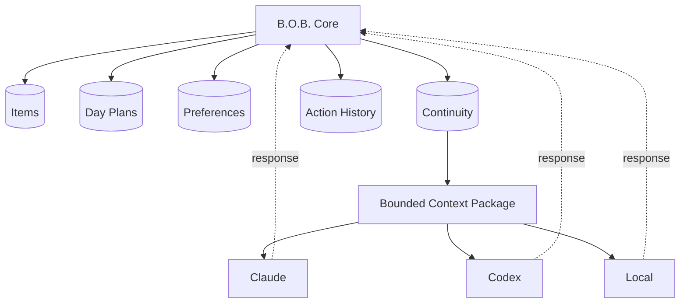

# RFC-0003: Local State and Continuity Model

**Status:** Proposed  
**Related:** ADR-0004, RFC-0001

## Proposal

B.O.B. shall maintain a versioned local canonical data store owned by the application core. Agent vendor sessions are integration details and must not be required to reconstruct the user's tasks, day plans, or B.O.B. preferences.

## Design goals

- single-user desktop simplicity;
- no required cloud service;
- schema versioning from the first revived release;
- safe restart behavior;
- atomic writes or transactional guarantees;
- exportable user-readable data;
- migration support;
- recoverable backup strategy;
- compact continuity across agent bridges.

## Data ownership

## Persistence mechanism

The implementation should choose the simplest mechanism that provides transactional or atomic persistence and migration. A relational local database is acceptable if its dependency and packaging cost remain small. A versioned structured file is acceptable if atomic recovery and indexing needs remain manageable.

The decision must be measured against actual product queries rather than presumed future scale.

## Required entities

### Item

Tasks, ideas, notes, and reminders share capture identity and may carry type-specific optional fields.

### DayPlan

Owns date, focus selection, blocks, and relevant planning metadata.

### Preference

Owns UI, accessibility, planning, agent, and cost-policy settings that are not protected secrets.

### ContinuityRecord

Stores compact summaries or links needed to carry relevant intent between agent calls. It should not become an indiscriminate transcript warehouse.

### ActionRecord

Stores enough information to explain material B.O.B. state changes and delegated operations without retaining sensitive model internals unnecessarily.

## Secret separation

API keys or provider credentials, if ever supported, are not ordinary canonical data. Store secret material in platform-appropriate protected storage and keep only references/configuration in normal persistence.

## Export

The user must be able to export core personal state in a documented, portable representation before public release.

## Migration

Every schema change must have an explicit migration path. Destructive resets are not an acceptable routine upgrade strategy.

## Recovery

On failed write or migration, B.O.B. should preserve the last known valid state and provide a recoverable backup rather than continuing with partially written state.

## Legacy import

Importing old prototype `localStorage` data is optional and should be implemented only if real retained user data justifies it. The revival must not inherit an awkward persistence model solely for hypothetical migration.

## Acceptance criteria

- restart preserves items and plans;
- schema version is explicit;
- migration behavior is tested;
- interrupted persistence cannot silently produce partially valid canonical state;
- secrets are not stored in ordinary exported state;
- agent provider loss does not erase B.O.B. continuity;
- export does not require an AI provider.
